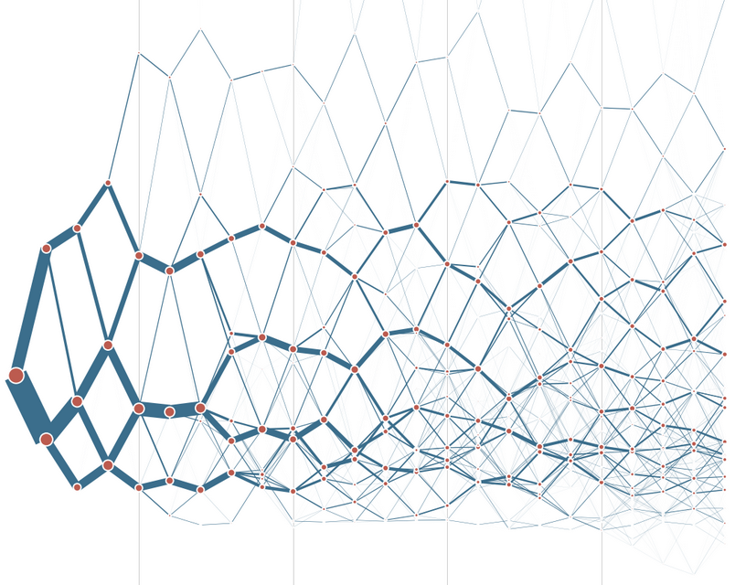

# *Classifying urban form at a national scale*

    *The case of Great Britain*

<table>
    <col width="50%">
    <col width="50%">
    <tr>
        <td>
            

                <a href="https://martinfleischmann.net/"><b>Martin Fleischmann</b></a>
            

        </td>
        <td>
            

                <a href="https://darribas.org"><b>Dani Arribas-Bel</b></a>
            

        </td>
    </tr>
    <tr>
        <td>
            

                <a href="https://twitter.com/martinfleis">[`@martinfleis`]</b></a>
            

        </td>
        <td>
            

                <a href="https://twitter.com/darribas">[`@darribas`]</b></a>
            

        </td>
    </tr>

</table>

<table>
    <col width="33%">
    <col width="33%">
    <col width="33%">
    <tr>
        <td>
            
        </td>
        <td>
            
        </td>
        <td>
            
        </td>
    </tr>
</table>

#
## Scaling morphological studies

    
        ... can be daunting
    

## Traditional schools

    
        ... (almost) cannot scale
    

<table>
    <col width="50%" height="50%">
    <col width="50%" height="50%">
    <tr>
        <td>
            

                
            

        </td>

        <td>
            

                
            

        </td>
    </tr>
</table>

Conzen (1960), Caniggia & Maffei (1979)

## Space Syntax

    
        ... can scale but offers limited insights
    

     

Space Syntax OpenMapping (2018)

## Morphometric approaches

    
        ... are trying to find a way
    

<table>
    <col width="25%" height="50%">
    <col width="25%" height="50%">
    <col width="25%" height="50%">
    <col width="25%" height="50%">
    <tr>
        <td>
            

                
            

        </td>

        <td>
            

                
            

        </td>
        <td>
            

                
            

        </td>

        <td>
            

                
            

        </td>
    </tr>
</table>

<small>Araldi & Fusco (2019), Berghauser Pont et al. (2019), Jochem et al. (2020), Fleischmann et al. (2021)</small>

## Opportunities

#
## Spatial Signatures

## {data-transition="none"}

    *A characterisation of space based on form and function designed to understand urban environments*

## {data-transition="none"}

    *A characterisation of space based on form and function designed to understand urban
    environments*

## {data-transition="none"}

    *A characterisation of space based on form and function designed to understand urban
    environments*

## {data-transition="none"}

    *A characterisation of space based on form and function designed to understand urban
        environments*

## Spatial Signatures

    

## Form

    
        One of the two components of Spatial Signatures
    

    Qualitative, quant. case studies, morphometrics, remotely sensed

<aside class="notes">
    Form-based classification can be extracted and analysed independently of function
    Disclaimer: The form-based classification is a part of it, hence some decisions are influenced by SpSig concept
</aside>

#

## Ordnance Survey Open Data

building footprints +  street network

    
        ... can be a bit limited.
    

<table>
    <col width="50%" height="50%">
    <col width="50%" height="50%">
    <tr>
        <td>
            

                
            

        </td>

        <td>
            

                
            

        </td>
    </tr>
</table>

(c) Ordnance Survey, (c) OpenStreetMap

## Spatial Unit
## Enclosed tessellation

<table>
    <col width="25%" height="50%">
    <col width="25%" height="50%">
    <col width="25%" height="50%">
    <col width="25%" height="50%">
    <tr>
        <td>
            

                
            

        </td>

        <td>
            

                 
            

        </td>
        <td>
            

                 
            

        </td>

        <td>
            

                 
            

        </td>
    </tr>
</table>

## How can we describe it...

    
        ... numerically?
    

## Urban morphometrics

    
        "quantitative analysis of urban form"
    

 

    
        All about measuring.
    

## Measuring

<table>
    <col width="33%">
    <col width="33%">
    <col width="33%">
    <tr>
        <td style="vertical-align:middle">
            

                
                    dimension
                
            

        </td>
        <td style="vertical-align:middle">
            

                
                    shape
                
            

        </td>
        <td style="vertical-align:middle">
            

                
                    spatial distribution
                
            

        </td>
    </tr>
    <tr>
        <td style="vertical-align:middle">
            

                
                    intensity
                
            

        </td>
        <td style="vertical-align:middle">
            

                
                    connectivity
                
            

        </td>
        <td style="vertical-align:middle">
            

                
                    diversity
                
            

        </td>
    </tr>
</table>

##

<table>
    <col width="33%">
    <col width="33%">
    <col width="33%">
    <tr>
        <td>
            

                Enclosed Tessellation
            

        </td>
        <td>
            

                Embedding *measurements*
            

        </td>
        <td>
            

                Clustering
            

        </td>
    </tr>

    <tr>
        <td class="fragment fade-in-then-semi-out">
            

                
            

        <td class="fragment fade-in-then-semi-out">
            

                
            

        </td>

        <td>
        </td>
    </tr>

</table>

## Context

Every piece of information is considered within its spatial context

## {data-transition="none"}

<table>
    <col width="33%">
    <col width="33%">
    <col width="33%">
    <tr>
        <td>
            

                Enclosed Tessellation
            

        </td>
        <td>
            

                Embedding *measurements*
            

        </td>
        <td>
            

                Clustering
            

        </td>
    </tr>

    <tr>
        <td class="fade-in-then-semi-out">
            

                
            

        </td>

        <td class="fade-in-then-semi-out">
            

                
            

        </td>

        <td class="fade-in-then-semi-out">
            

                
            

        </td>
    </tr>

</table>

#
## Results

## 19 classes in 3 main groups

<table>
    <col width="33%">
    <col width="33%">
    <col width="33%">
    <tr>
        <td style="vertical-align:middle">
            

                
                    countryside
                
            

        </td>
        <td style="vertical-align:middle">
            

                
                    low density development
                
            

        </td>
        <td style="vertical-align:middle">
            

                
                    dense city centres
                
            

        </td>
    </tr>
</table>

## {data-transition="fade"}

Liverpool - Manchester

## {data-transition="fade"}

Liverpool - Manchester

## {data-transition="fade"}

Liverpool - Manchester

## {data-transition="fade"}

Liverpool - Manchester

## {data-transition="fade"}

Birmingham

## {data-transition="fade"}

Birmingham

## {data-transition="fade"}

Birmingham

## {data-transition="fade"}

Birmingham

## {data-transition="fade"}

London

## {data-transition="fade"}

London

## {data-transition="fade"}

London

## {data-transition="fade"}

London

## Concentric character of British centers and centre hierarchy

## {data-transition="fade"}

London

##
<table>
    <col width="50%">
    <col width="50%">
    <tr>
        <td style="vertical-align:middle">
            

                
            

        </td>
        <td style="vertical-align:middle">
            

                
            

        </td>
    </tr>
</table>

Birmingham, Edinburgh

##
<table>
    <col width="50%">
    <col width="50%">
    <tr>
        <td style="vertical-align:middle">
            

                
            

        </td>
        <td style="vertical-align:middle">
            

                
            

        </td>
    </tr>
</table>

Southampton, Oxford

## Milton Keynes

    
        ... does not have a (morphological) centre
    

##

    

#
## To take away

<ol>
<li>
Urban morphology can be scaled
</li>
<li class="fragment">
Form component of Spatial Signatures: classification of urban form in detail, at scale
</li>
<li class="fragment">
Good measurement $\rightarrow$ better understanding
</li>
</ol>

# *Classifying urban form at a national scale*

    *The case of Great Britain*

<table>
    <col width="50%">
    <col width="50%">
    <tr>
        <td>
            

                <a href="https://martinfleischmann.net/"><b>Martin Fleischmann</b></a>
            

        </td>
        <td>
            

                <a href="https://darribas.org"><b>Dani Arribas-Bel</b></a>
            

        </td>
    </tr>
    <tr>
        <td>
            

                <a href="https://twitter.com/martinfleis">[`@martinfleis`]</b></a>
            

        </td>
        <td>
            

                <a href="https://twitter.com/darribas">[`@darribas`]</b></a>
            

        </td>
    </tr>

</table>

<table>
    <col width="33%">
    <col width="33%">
    <col width="33%">
    <tr>
        <td>
            
        </td>
        <td>
            
        </td>
        <td>
            
        </td>
    </tr>
</table>