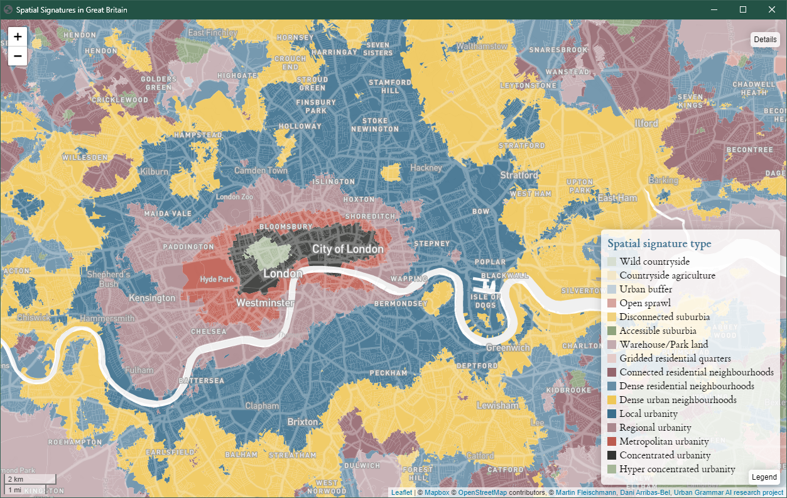

# *Urban Grammar*
<!-- 15 minutes talk, 5mins questions -->

    *(Urban) form/function through satellite data & AI*

    https://urbangrammarai.xyz

<table>
    <col width="50%">
    <col width="50%">
    <tr>
        <td>
            

                <a href="https://darribas.org"><b>Dani Arribas-Bel</b></a>
            

        </td>
        <td>
            

                <a href="https://martinfleischmann.net/"><b>Martin Fleischmann</b></a>
            

        </td>
    </tr>
    <tr>
        <td>
            

            <SMALL>
                <a href="https://twitter.com/darribas">[`@darribas`]</b></a>
            </SMALL>
            

        </td>
        <td>
            

            <SMALL>
                <a href="https://twitter.com/martinfleis">[`@martinfleis`]</b></a>
            </SMALL>
            

        </td>
    </tr>

</table>

<table>
    <col width="33%">
    <col width="33%">
    <col width="33%">
    <tr>
        <td>
            
        </td>
        <td>
            
        </td>
        <td>
            
        </td>
    </tr>
</table>

#
##

#
## "The point"

## {data-transition="none"}

How we arrange "stuff" in cities matters...

<table>
<col width="50%">
<col width="50%">
<tr>
    <td>
    

    

    </td>

    <td>
    

    

    </td>
</tr>
</table>

Source: *A map of every building in America* ([New York Times](https://www.nytimes.com/interactive/2018/10/12/us/map-of-every-building-in-the-united-states.html))

##

... it matters *a lot*

<table>
<col width="33%" height="50%">
<col width="33%" height="50%">
<col width="33%" height="50%">
<tr>
    <td>
    

    

    </td>

    <td>
    

    

    </td>

    <td>
    

    

    </td>
</tr>
<tr>
    <td>
    

    

    </td>

    <td>
    

    

    </td>

    <td>
    

    

    </td>
</tr>
</table>

##

`Form`

*What does it look like?*

"Physical structure and appearance of cities"

`Function`

*What is it used for?*

"Activities that take place within an environment"

##

#
## Spatial Signatures

## {data-transition="none"}

    *A characterisation of space based on form and function designed to understand urban environments*

## {data-transition="none"}

    *A characterisation of space based on form and function designed to understand urban
    environments*

## {data-transition="none"}

    *A characterisation of space based on form and function designed to understand urban
    environments*

## {data-transition="none"}

    *A characterisation of space based on form and function designed to understand urban
        environments*

##

<table>
<col width="60%">
<col width="40%">
<tr>
    <td  style="vertical-align:middle;box-shadow:none">
BRITISH SIGNATURES

<u>**Countryside**</u>

- 

<u>**Urban Areas**</u>

- Periphery 
- Suburbs 
- Cities 

</td>
<td style="vertical-align:middle;box-shadow:none">

    </td>
<tr>
</table>

## {data-transition="none" data-background-image="../fig/gb/signatures_scottish_belt.png" data-background-size="cover"}
## {data-transition="none" data-background-image="../fig/gb/signatures_scottish_belt_rural.png" data-background-size="cover"}
## {data-transition="none" data-background-image="../fig/gb/signatures_scottish_belt_urban.png" data-background-size="cover"}

## London's unique...

## Milton Keynes...

#
## Building an Urban Grammar

<ul>
<li class='fragment'> Spatial Signatures are *building blocks* (the "words")</li>
<li class='fragment'> For the rules to combine them, you need *time*</li>
<li class='fragment'> `Phase II`: learn Spatial Signatures from *satellite*</li>
</ul>

## Timeline

- 🎅🎄Open data products: Spatial Signatures
- `2022-Q1`: AI experiments
- `2022`: Temporal open data product

#
##

# *Urban Grammar*

    *(Urban) form/function through satellite data & AI*

    https://urbangrammarai.xyz

<table>
    <col width="50%">
    <col width="50%">
    <tr>
        <td>
            

                <a href="https://darribas.org"><b>Dani Arribas-Bel</b></a>
            

        </td>
        <td>
            

                <a href="https://martinfleischmann.net/"><b>Martin Fleischmann</b></a>
            

        </td>
    </tr>
    <tr>
        <td>
            

            <SMALL>
                <a href="https://twitter.com/darribas">[`@darribas`]</b></a>
            </SMALL>
            

        </td>
        <td>
            

            <SMALL>
                <a href="https://twitter.com/martinfleis">[`@martinfleis`]</b></a>
            </SMALL>
            

        </td>
    </tr>

</table>

<table>
    <col width="33%">
    <col width="33%">
    <col width="33%">
    <tr>
        <td>
            
        </td>
        <td>
            
        </td>
        <td>
            
        </td>
    </tr>
</table>

#
## Appendix

## Enclosed Tessellation

<table>
<col width="25%">
<col width="25%">
<col width="25%">
<col width="25%">
<tr>
    <td>
    

    
    

</td>
<td>
    

    
    

</td>
<td>
    

    
    

</td>
<td>
    

    
    

</td>
<tr>
</table>

## Characters

<table>
<col width="45%">
<col width="10%">
<col width="45%">
<tr>
    <td>
    

    *Form*
    

- Dimension
- Shape
- Intensity
- Connectivity
- Diversity
</td>
<td>
</td>
<td>
    

    *Function*
    

- Population
- Employment
- Industry
- Land use/cover
- Amenity access
    </td>
<tr>
</table>

$N \approx 300$

## Context

