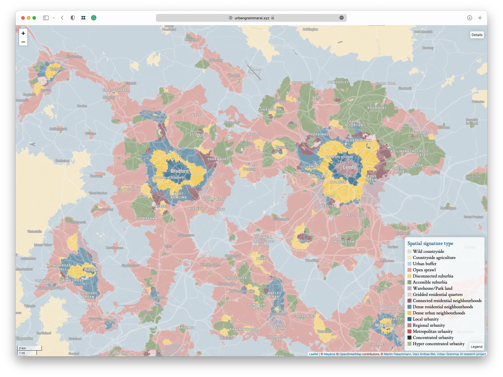
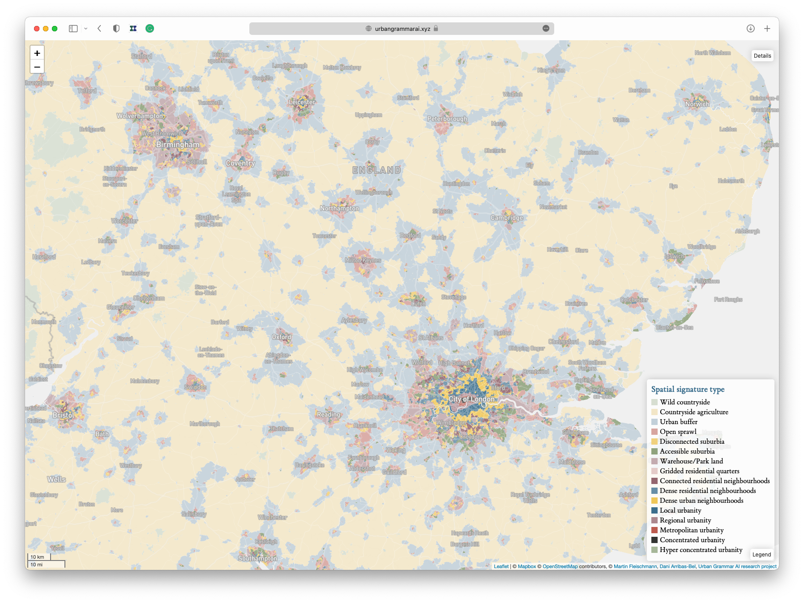

# *Spatial Signatures in Great Britain*

    *Open source classification of space*

    https://urbangrammarai.xyz

<table>
    <col width="50%">
    <col width="50%">
    <tr>
        <td>
            

                <a href="https://martinfleischmann.net/"><b>Martin Fleischmann</b></a>
            

        </td>
        <td>
            

                <a href="https://darribas.org"><b>Dani Arribas-Bel</b></a>
            

        </td>
    </tr>
    <tr>
        <td>
            

            <SMALL>
                <a href="https://twitter.com/martinfleis">[`@martinfleis`]</b></a>
            </SMALL>
            

        </td>
        <td>
            

            <SMALL>
                <a href="https://twitter.com/darribas">[`@darribas`]</b></a>
            </SMALL>
            

        </td>
    </tr>

</table>

<table>
    <col width="33%">
    <col width="33%">
    <col width="33%">
    <tr>
        <td>
            
        </td>
        <td>
            
        </td>
        <td>
            
        </td>
    </tr>
</table>

#
## {data-transition="none"}

How we arrange "stuff" in cities matters...

<table>
<col width="50%">
<col width="50%">
<tr>
    <td>
    

    

    </td>

    <td>
    

    

    </td>
</tr>
</table>

Source: *A map of every building in America* ([New York Times](https://www.nytimes.com/interactive/2018/10/12/us/map-of-every-building-in-the-united-states.html))

##

... it matters *a lot*

<table>
<col width="33%" height="50%">
<col width="33%" height="50%">
<col width="33%" height="50%">
<tr>
    <td>
    

    

    </td>

    <td>
    

    

    </td>

    <td>
    

    

    </td>
</tr>
<tr>
    <td>
    

    

    </td>

    <td>
    

    

    </td>

    <td>
    

    

    </td>
</tr>
</table>

##

`Form`

*What does it look like?*

"Physical structure and appearance of cities"

`Function`

*What is it used for?*

"Activities that take place within an environment"

#
## Spatial Signatures

## {data-transition="none"}

    *A characterisation of space based on form and function designed to understand urban environments*

## {data-transition="none"}

    *A characterisation of space based on form and function designed to understand urban
    environments*

## {data-transition="none"}

    *A characterisation of space based on form and function designed to understand urban
    environments*

## {data-transition="none"}

    *A characterisation of space based on form and function designed to understand urban
        environments*

## Characters

<table>
<col width="45%">
<col width="10%">
<col width="45%">
<tr>
    <td>
    

    *Form*
    

- Dimension
- Shape
- Intensity
- Connectivity
- Diversity
</td>
<td>
</td>
<td>
    

    *Function*
    

- Population
- Employment
- Industry
- Land use/cover
- Amenity access
    </td>
<tr>
</table>

$N \approx 300$

#
## Spatial Signatures of Great Britain

##

##

## The map

    https://urbangrammarai.xyz/great-britain

## The data

 

# *Spatial Signatures in Great Britain*

    *Open source classification of space*

    https://urbangrammarai.xyz

<table>
    <col width="50%">
    <col width="50%">
    <tr>
        <td>
            

                <a href="https://martinfleischmann.net/"><b>Martin Fleischmann</b></a>
            

        </td>
        <td>
            

                <a href="https://darribas.org"><b>Dani Arribas-Bel</b></a>
            

        </td>
    </tr>
    <tr>
        <td>
            

            <SMALL>
                <a href="https://twitter.com/martinfleis">[`@martinfleis`]</b></a>
            </SMALL>
            

        </td>
        <td>
            

            <SMALL>
                <a href="https://twitter.com/darribas">[`@darribas`]</b></a>
            </SMALL>
            

        </td>
    </tr>

</table>

<table>
    <col width="33%">
    <col width="33%">
    <col width="33%">
    <tr>
        <td>
            
        </td>
        <td>
            
        </td>
        <td>
            
        </td>
    </tr>
</table>