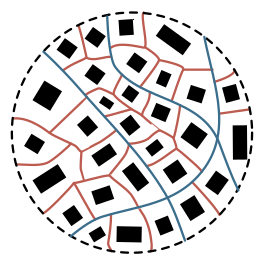
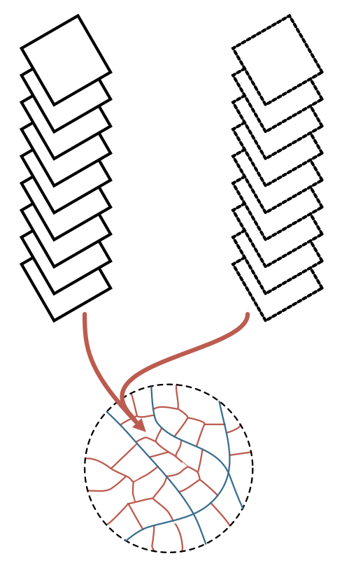
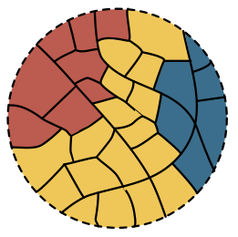
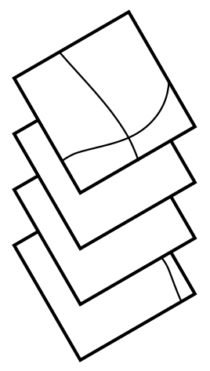
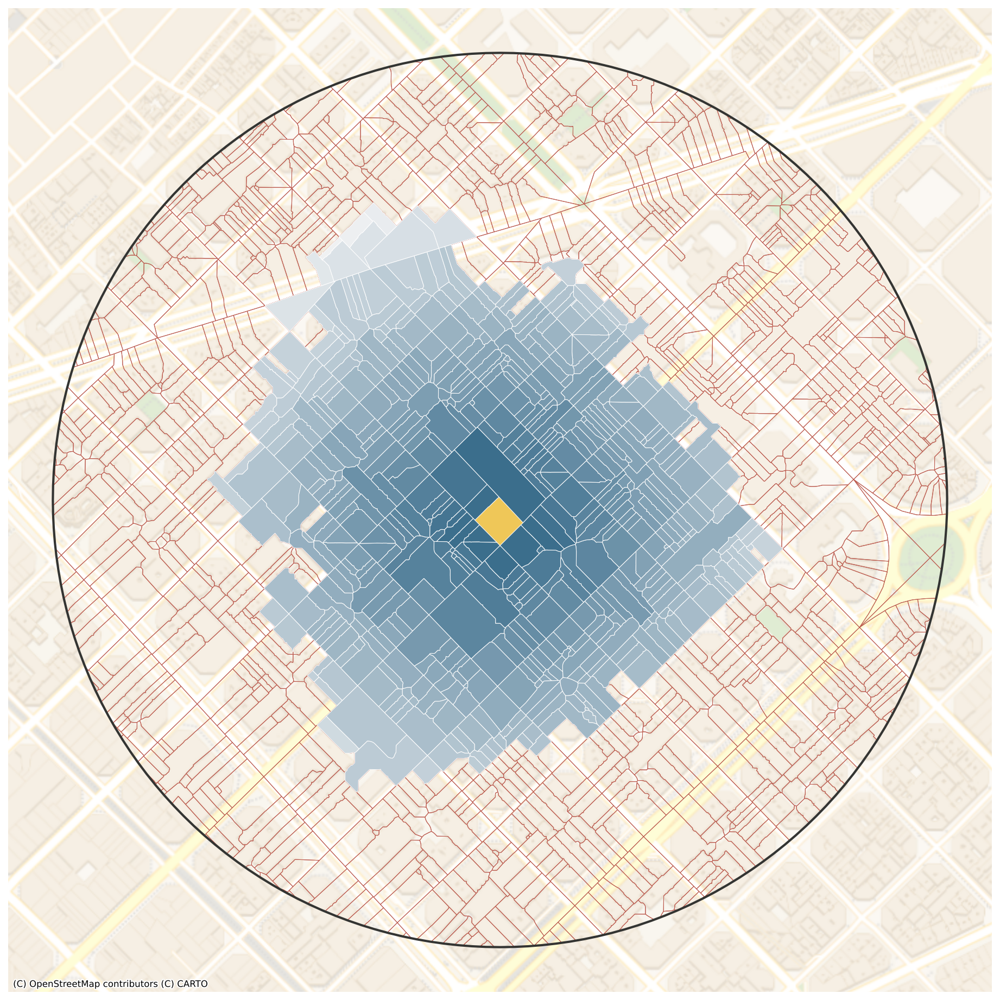
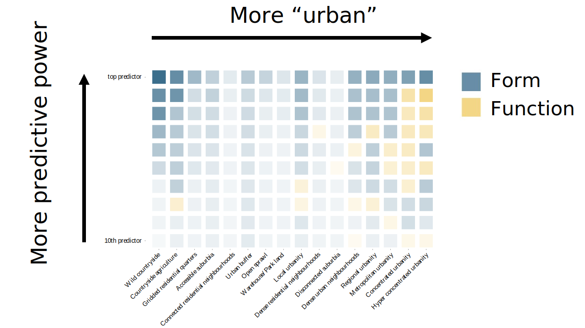

# *(Urban) form/function in Great Britain*

    https://urbangrammarai.xyz

<table>
    <col width="50%">
    <col width="50%">
    <tr>
        <td>
            

                <a href="https://darribas.org"><b>Dani Arribas-Bel</b></a>
            

        </td>
        <td>
            

                <a href="https://martinfleischmann.net/"><b>Martin Fleischmann</b></a>
            

        </td>
    </tr>
    <tr>
        <td>
            

            <SMALL>
                <a href="https://twitter.com/darribas">[`@darribas`]</b></a>
            </SMALL>
            

        </td>
        <td>
            

            <SMALL>
                <a href="https://twitter.com/martinfleis">[`@martinfleis`]</b></a>
            </SMALL>
            

        </td>
    </tr>

</table>

<table>
    <col width="33%">
    <col width="33%">
    <col width="33%">
    <tr>
        <td>
            
        </td>
        <td>
            
        </td>
        <td>
            
        </td>
    </tr>
</table>

#
## "The point"

## {data-transition="none"}

How we arrange "stuff" in cities matters...

<table>
<col width="50%">
<col width="50%">
<tr>
    <td>
    

    

    </td>

    <td>
    

    

    </td>
</tr>
</table>

Source: *A map of every building in America* ([New York Times](https://www.nytimes.com/interactive/2018/10/12/us/map-of-every-building-in-the-united-states.html))

##

... it matters *a lot*

<table>
<col width="33%" height="50%">
<col width="33%" height="50%">
<col width="33%" height="50%">
<tr>
    <td>
    

    

    </td>

    <td>
    

    

    </td>

    <td>
    

    

    </td>
</tr>
<tr>
    <td>
    

    

    </td>

    <td>
    

    

    </td>

    <td>
    

    

    </td>
</tr>
</table>

## Form & Function

`Form`

*What does it look like?*

"Physical structure and appearance of cities"

`Function`

*What is it used for?*

"Activities that take place within an environment"

##

#
## Spatial Signatures

## {data-transition="none"}

    *A characterisation of space based on form and function designed to understand urban environments*

## {data-transition="none"}

    *A characterisation of space based on form and function designed to understand urban
    environments*

## {data-transition="none"}

    *A characterisation of space based on form and function designed to understand urban
    environments*

## {data-transition="none"}

    *A characterisation of space based on form and function designed to understand urban
        environments*

## Building *Spatial Signatures* {data-transition="none"}

<SMALL>
**[STAGE]**
Delimiters
Enclosure
Anchors
Encl. Tess.
Characters
Clusters
Signatures
</SMALL>

<table>
<col width="33%">
<col width="33%">
<col width="33%">
<tr>
    <td>
    

    Enclosed Tessellation
    

    </td>
    <td>
    

    Embedding *form* & *function*
    

    </td>
    <td>
    

    Spatial Signatures
    

    </td>
</tr>

<tr>
    <td class="fragment fade-in-then-semi-out" data-fragment-index="4">
    

    

    </td>

    <td class="fragment fade-in-then-semi-out" data-fragment-index="5">
    

    

    </td>

    <td class="fragment fade-in-then-semi-out" data-fragment-index="7">
    

    

    </td>
</tr>

<tr>
    <td class="fragment fade-in-then-semi-out" data-fragment-index="2">
    

    +

    

    </td>

    <td>
    

    

    </td>

    <td class="fragment fade-in-then-semi-out" data-fragment-index="6">
    

    

    </td>
</tr>

<tr>
    <td class="fragment fade-in-then-semi-out" data-fragment-index="1">
    

    

    </td>

    <td>
    

    

    </td>

    <td>
    

    

    </td>
</tr>

</table>

## Building *Spatial Signatures* {data-transition="none"}

<SMALL>
**[STAGE]**
Delimiters
Enclosure
Anchors
Encl. Tess.
Characters
Clusters
Signatures
</SMALL>

<table>
<col width="33%">
<col width="33%">
<col width="33%">
<tr>
    <td>
    

    Enclosed Tessellation
    

    </td>
    <td>
    

    Embedding *form* & *function*
    

    </td>
    <td>
    

    Spatial Signatures
    

    </td>
</tr>

<tr>
    <td>
    

    

    </td>

    <td>
    

    

    </td>

    <td>
    

    

    </td>
</tr>

<tr>
    <td>
    

    +

    

    </td>

    <td>
    

    

    </td>

    <td>
    

    

    </td>
</tr>

<tr>
    <td>
    

    

    </td>

    <td>
    

    

    </td>

    <td>
    

    

    </td>
</tr>

</table>

#
## Great Britain

## Characters

<table>
<col width="45%">
<col width="10%">
<col width="45%">
<tr>
    <td>
    

    *Form*
    

- Dimension
- Shape
- Intensity
- Connectivity
- Diversity
</td>
<td>
</td>
<td>
    

    *Function*
    

- Population
- Employment
- Industry
- Land use/cover
- Amenity access
    </td>
<tr>
</table>

$N \approx 300$

## Context

## Data

<table>
<col width="45%">
<col width="10%">
<col width="45%">
<tr>
    <td>
    

    *Form*
    

- OS OpenMap
- OS OpenRoads
</td>
<td>
</td>
<td>
    

    *Function*
    

- (Business) Census
- OpenStreetMap
- Geolytix
- Listed buildings
- CDRC
- CORINE / Sentinel 2
- VIIRS
    </td>
<tr>
</table>

#
## British Signatures

##

<table>
<col width="60%">
<col width="40%">
<tr>
    <td  style="vertical-align:middle;box-shadow:none">
<u>BRITISH SIGNATURES</u>

**Countryside** (3)
 

**Periphery** (4)
 

**Urban** (9)

 

</td>
<td style="vertical-align:middle;box-shadow:none">

    </td>
</tr>
</table>

## {data-transition="none" data-background-image="../fig/empirical/signatures_scottish_belt.png" data-background-size="cover"}
## {data-transition="none" data-background-image="../fig/empirical/signatures_scottish_belt_countryside.png" data-background-size="cover"}
## {data-transition="none" data-background-image="../fig/empirical/signatures_scottish_belt_periphery.png" data-background-size="cover"}
## {data-transition="none" data-background-image="../fig/empirical/signatures_scottish_belt_urban.png" data-background-size="cover"}

## (Geographical) Coverage

## 94% (50%) {data-transition="none" data-background-image="../fig/empirical/cov_countryside.png" data-background-size="contain"}
## 5% (40%) {data-transition="none" data-background-image="../fig/empirical/cov_periphery.png" data-background-size="contain"}
## 1% (10%) {data-transition="none" data-background-image="../fig/empirical/cov_centres.png" data-background-size="contain"}

## Distribution/co-occurrence
## {data-transition="none" data-background-image="../fig/empirical/geog_distribution_co_occurence.png" data-background-size="contain"}

## Urban hierarchy
## {data-transition="none" data-background-image="../fig/empirical/hierarchy.png" data-background-size="contain"}

## Signature drivers

#
## Conclusions

1. Urban *form* and *function* matters
1. Spatial Signatures: F&F for cities, in detail, at scale
1. Good measurement $\rightarrow$ better understanding

# *(Urban) form/function in Great Britain*

    https://urbangrammarai.xyz

<table>
    <col width="50%">
    <col width="50%">
    <tr>
        <td>
            

                <a href="https://darribas.org"><b>Dani Arribas-Bel</b></a>
            

        </td>
        <td>
            

                <a href="https://martinfleischmann.net/"><b>Martin Fleischmann</b></a>
            

        </td>
    </tr>
    <tr>
        <td>
            

            <SMALL>
                <a href="https://twitter.com/darribas">[`@darribas`]</b></a>
            </SMALL>
            

        </td>
        <td>
            

            <SMALL>
                <a href="https://twitter.com/martinfleis">[`@martinfleis`]</b></a>
            </SMALL>
            

        </td>
    </tr>

</table>

<table>
    <col width="33%">
    <col width="33%">
    <col width="33%">
    <tr>
        <td>
            
        </td>
        <td>
            
        </td>
        <td>
            
        </td>
    </tr>
</table>

