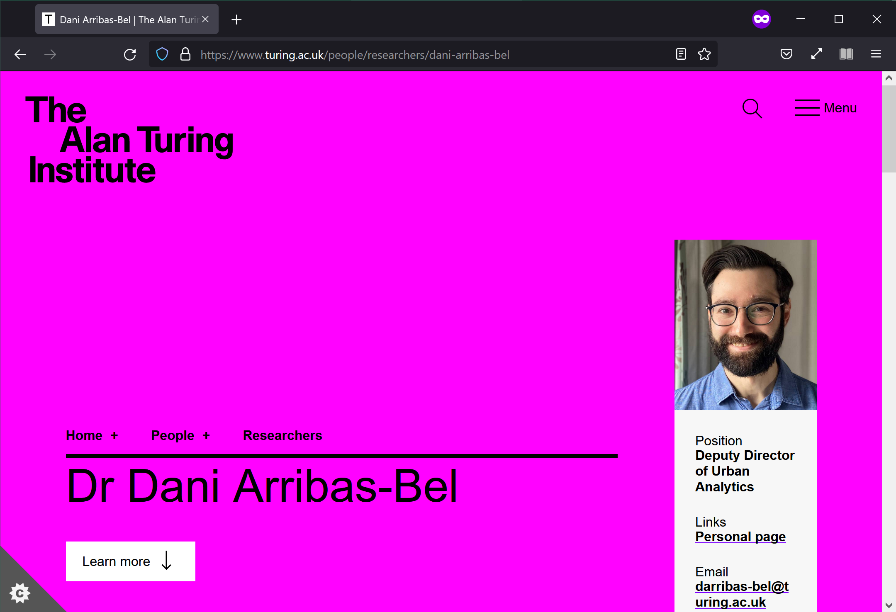
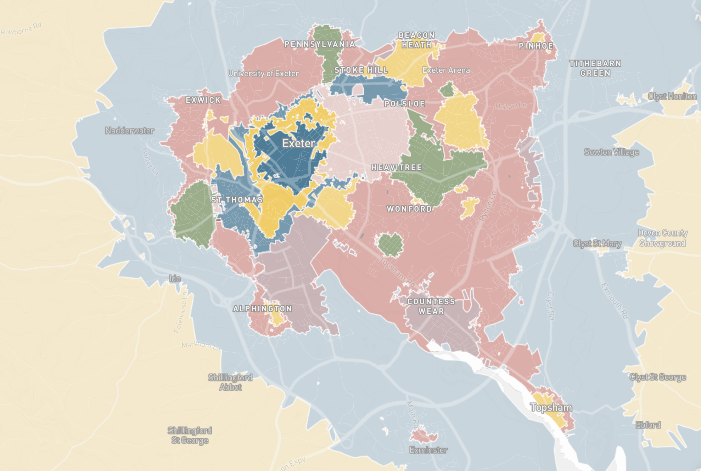

#

#

# Goals

1. Develop Spatial Signatures

*A characterisation of space based on form and function designed to understand urban environments*

2. Learn SS from satellite imagery through AI

# Spatial Signatures

<table>
<col width="30%">
<col width="70%">
<tr>
<td style="vertical-align:middle;box-shadow:none">

    </td>
<td class='fragment' style="vertical-align:middle;box-shadow:none">

    </td>
</tr>
</table>

# What for?

- Understanding (change in) cities in detail
*and* at scale
- Building block (urban form & function *made easy*)
    - Sustainability
    - Productivity
    - Inequalities
    - ...

#

<LARGE>
    https://urbangrammarai.xyz
</LARGE>

