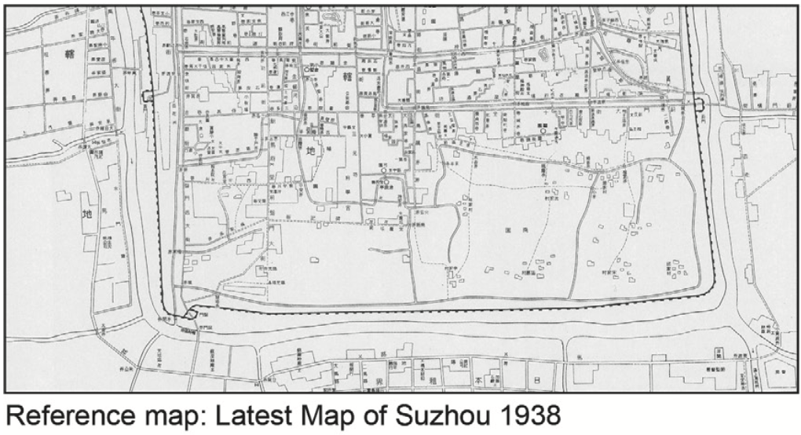
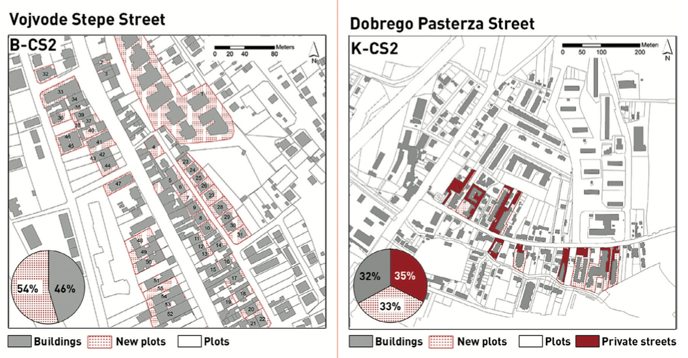
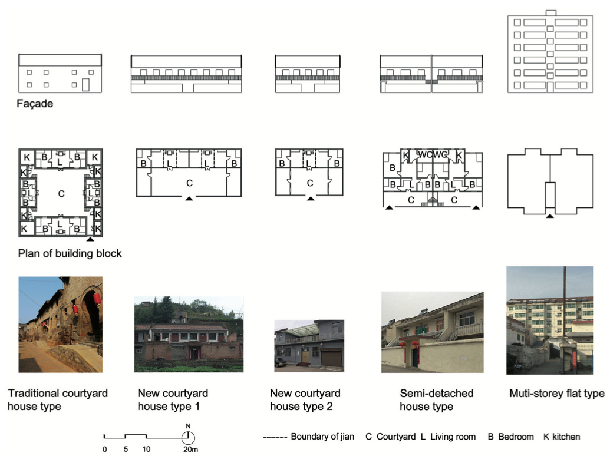
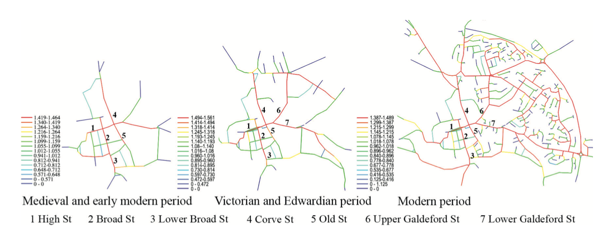
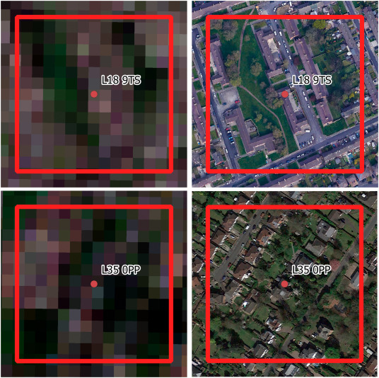
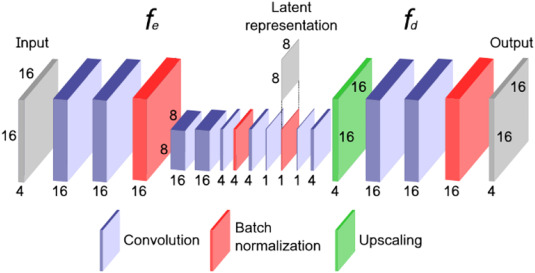
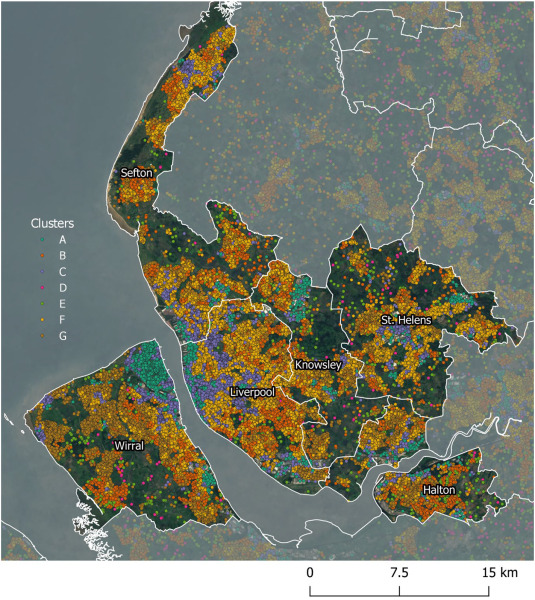

#

    <h4>
    *Detecting urban typology from multispectral satellite imagery using neural networks*
    </h4>

<table>
    <col width="50%">
    <col width="50%">
    <tr>
        <td>
            

                <a href="https://martinfleischmann.net/"><b>Martin Fleischmann</b></a>
            

        </td>
        <td>
            

                <a href="https://darribas.org"><b>Dani Arribas-Bel</b></a>
            

        </td>
    </tr>
    <tr>
        <td>
            

                <a href="https://uk.linkedin.com/in/murraydata"><b>John Murray</b></a>
            

        </td>
        <td>
            

                <a href="https://www.alex-singleton.com/"><b>Alex Singleton</b></a>
            

        </td>
    </tr>

</table>

<table>
    <col width="33%">
    <col width="33%">
    <col width="33%">
    <tr>
        <td>
            
        </td>
        <td>
            
        </td>
        <td>
            
        </td>
    </tr>
</table>

#

## The data

A quick overview of data used in the recent publications in Urban Morphology.

##

Fu et al. (2022)

##

Kantarek et al. (2022)

##

Guo and Ding (2021)

##

Li and Zhang (2021)

#

## The issue

<ul style="list-style: none">
    <li class="fragment">availability</li>
    <li class="fragment">reliability</li>
    <li class="fragment">processing demands</li>
</ul>

## The issue

Urban morphology is bounded by the data availability and the ability to extract morphological information out of it.

#

## The solution (?)

##  🛰

## {data-transition="none" data-background-image="../fig/gisruk/hires.png" data-background-size="cover"}

## Sentinel 2

#

## Morphology and imagery

<ul style="list-style: none">
    <li class="fragment">supervised methods</li>
    <li class="fragment"><strong>un</strong>supervised methods</li>
</ul>

#

## Predicting Spatial Signatures

supervised learning

## Spatial Signatures

## {data-transition="none"}

    *A characterisation of space based on form and function designed to understand urban environments*

##

<iframe src="https://urbangrammarai.xyz/great-britain/#" width="1400px" height="600px" style="border: none;"></iframe>

## {data-transition="none" data-background-image="../fig/empirical/signatures_scottish_belt.png" data-background-size="cover"}

## {data-transition="none" data-background-image="../fig/empirical/signatures_scottish_belt_countryside.png" data-background-size="cover"}

## {data-transition="none" data-background-image="../fig/empirical/signatures_scottish_belt_periphery.png" data-background-size="cover"}

## {data-transition="none" data-background-image="../fig/empirical/signatures_scottish_belt_urban.png" data-background-size="cover"}

## What do we want to do?

train a neural network

understand the role of geography

## Chip size effect

## {data-transition="none" data-background-image="../fig/gisruk/chips_80.png" data-background-size="contain"}

80x80m: 13760 chips, which is 74 % of maximum

## {data-transition="none" data-background-image="../fig/gisruk/chips_160.png" data-background-size="contain"}

160x160m: 2718 chips within, which is 57 % of maximum

## {data-transition="none" data-background-image="../fig/gisruk/chips_320.png" data-background-size="contain"}

320x320m: 423 chips within, which is 35 % of maximum

## {data-transition="none" data-background-image="../fig/gisruk/chips_640.png" data-background-size="contain"}

640x640m: 38 chips within, which is 13 % of maximum

## {data-transition="none" data-background-image="../fig/gisruk/chips_320_all.png" data-background-size="contain"}

320x320m, chips capturing the proportion (100% of maximum)

## {data-background-image="../fig/gisruk/mor_conf.png" data-background-size="contain"}

Multi-output regression - Overall accuracy 43.5%

## {data-transition="none" data-background-image="../fig/gisruk/mor_country.png" data-background-size="contain"}

Wild countryside

## {data-transition="none" data-background-image="../fig/gisruk/mor_urban.png" data-background-size="contain"}

Urbanity

## Still work in progress

#

## Estimating generalized measures of local neighbourhood context

unsupervised learning

##

##

##

# The takeaway

<ul style="list-style: none">
    <li class="fragment">We are limited by the data we are used to</li>
    <li class="fragment">Can satellite imagery and AI resolve it?</li>
    <li class="fragment">Probably not. Not all of it and not yet.</li>
</ul>

#

    <h4>
    *Detecting urban typology from multispectral satellite imagery using neural networks*
    </h4>

<table>
    <col width="50%">
    <col width="50%">
    <tr>
        <td>
            

                <a href="https://martinfleischmann.net/"><b>Martin Fleischmann</b></a>
            

        </td>
        <td>
            

                <a href="https://darribas.org"><b>Dani Arribas-Bel</b></a>
            

        </td>
    </tr>
    <tr>
        <td>
            

                <a href="https://uk.linkedin.com/in/murraydata"><b>John Murray</b></a>
            

        </td>
        <td>
            

                <a href="https://www.alex-singleton.com/"><b>Alex Singleton</b></a>
            

        </td>
    </tr>

</table>

<table>
    <col width="33%">
    <col width="33%">
    <col width="33%">
    <tr>
        <td>
            
        </td>
        <td>
            
        </td>
        <td>
            
        </td>
    </tr>
</table>
