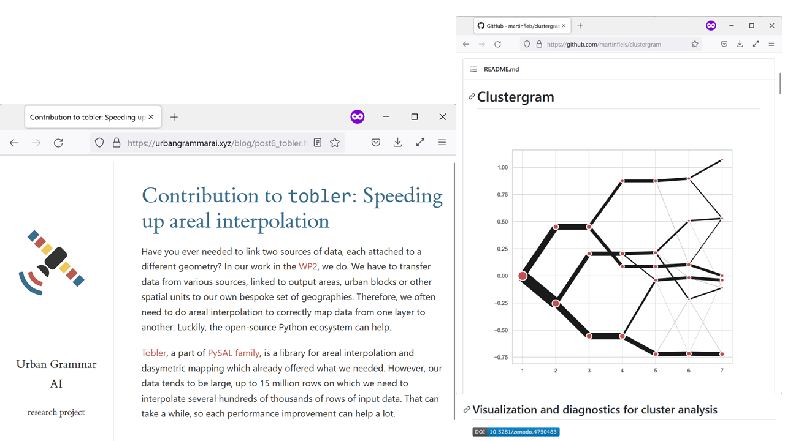
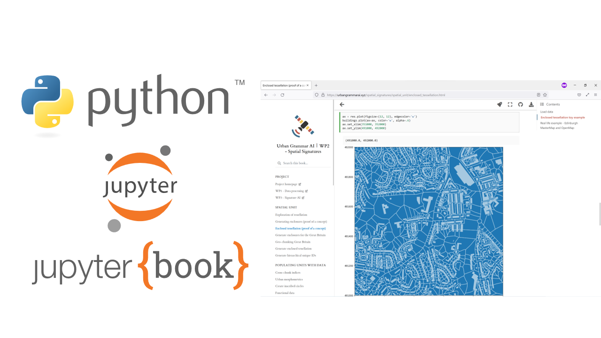
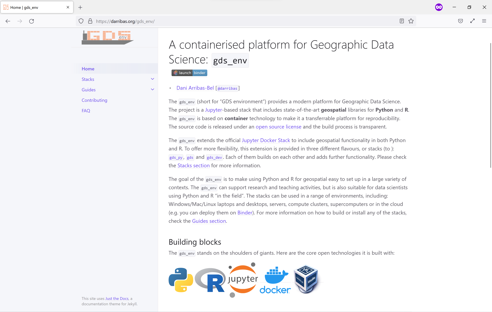
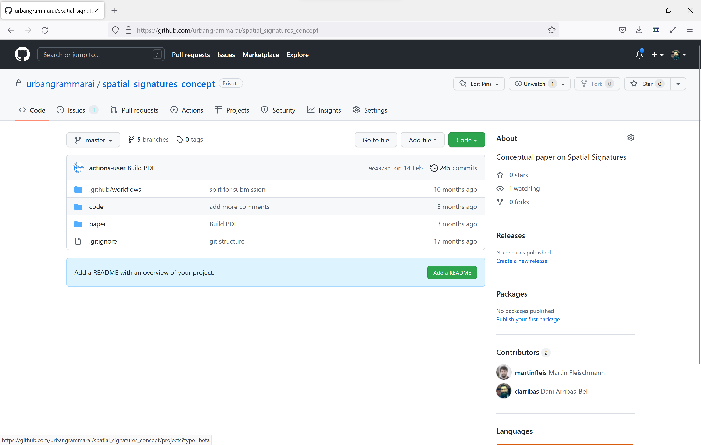
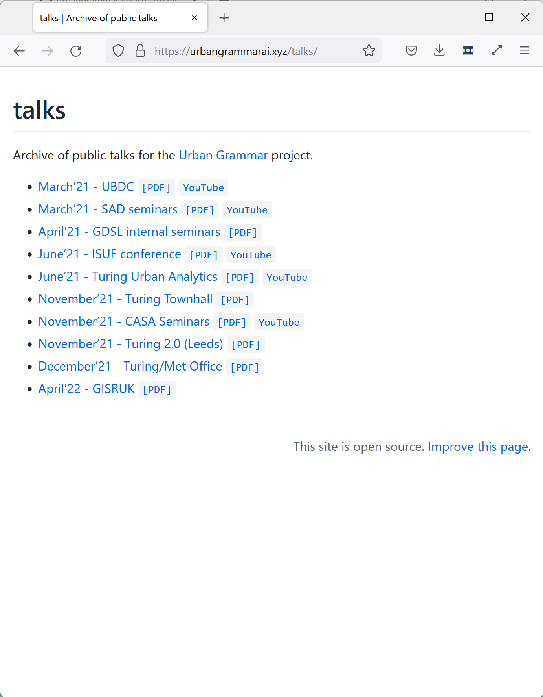
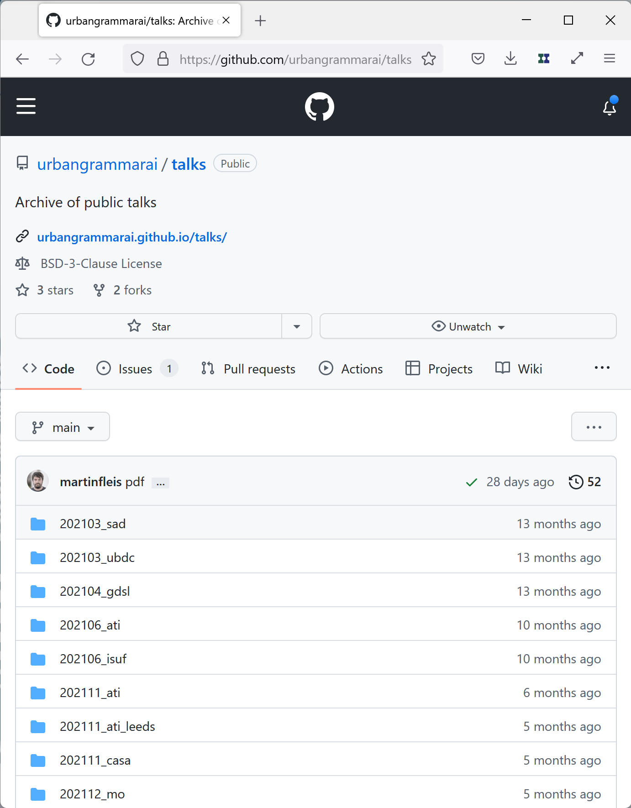
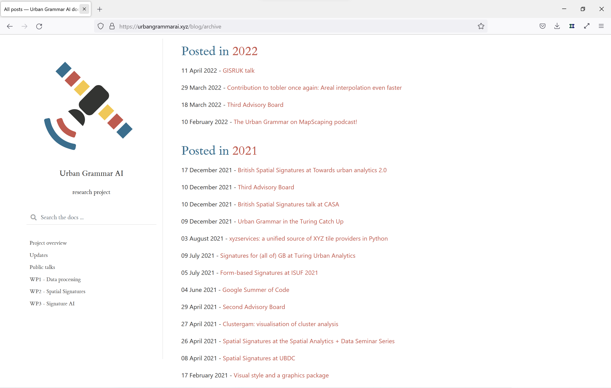
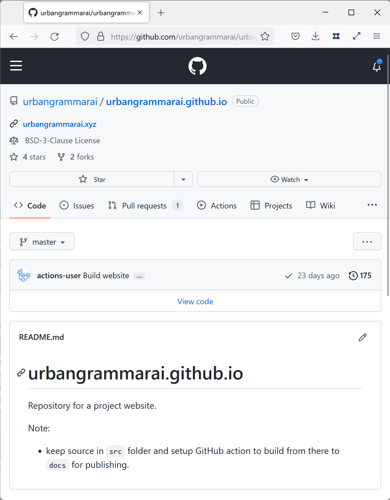

# *"Open by Default"*

    <h4>
    Developing reproducible, computational research
    </h4>

 
<table>
    <col width="50%">
    <col width="50%">
    <tr>
        <td>
            

                <a href="https://darribas.org"><b>Dani Arribas-Bel</b></a>
                 `@darribas`
            

        </td>
        <td>
            

                <a href="https://martinfleischmann.net/"><b>Martin Fleischmann</b></a>
                 `@martinfleis`
            

        </td>
    </tr>

</table>

<table>
    <col width="27%">
    <col width="27%">
    <col width="27%">
    <col width="15%">
    <tr>
        <td>
            
        </td>
        <td>
            
        </td>
        <td>
            
        </td>
        <td>
            
        </td>
    </tr>
</table>

#

## *Open research*

<ul>
<li class='fragment'> Open! Open? "Open"; _Open_; Open</li>

<ol class='fragment'>
   <li>Transparent</li>
   <li>Accessible</li>
   <li>Transferrable</li>
</ol>

<li class='fragment'> Open data is _not_ necessary, _nor_
sufficient</li>
</ul>

## *"Open by default"*

- Like happiness, it's about the journey not (only) the destination
- Treat research artifacts as OSS from Day 1
- Use (and nurture) the *existing* OSS infrastructure

#

## For example

## {data-background-image="../fig/misc/urban_grammar_project.png" data-background-size="contain"}

## Urban Grammar

    *A characterisation of space based on form and function designed to understand urban environments*

+ Satellite imagery & AI

## Needs

<table>
    <col width="50%">
    <col width="50%">
    <tr>
        <td>
        <!--https://www.rawpixel.com/image/573086/antique-cooking-utensils-from-pompeii-->
        
        </td>
        <td class='fragment'  data-fragment-index="1">
        <!--https://freesvg.org/vector-illustration-of-spotty-sausage-->
        
        </td>
    </tr>
    <tr>
        <td>
- Data, data, data
- (New) methods, (new) code
- Infrastructure
        </td>
<td class='fragment'  data-fragment-index="1">
- (Academic) dissemination
- Open Data Products
- Journaling/reporting
</td>
    </tr>
</table>

#

## The kitchen

## Data

- Standard (formats) better than niche
- Open better than proprietary
- Static better than DB

E.g., parquet, COGs

## New methods

## New code

## Infrastructure

#

## ... and the "sausage"

## Dissemmination (I): Papers

## Dissemmination (II): Talks

<table>
    <col width="65%">
    <col width="35%">
    <tr>
        <td>
            

            
            

        </td>
        <td>
            

            
            

        </td>
    </tr>
</table>

## Dissemmination (III): Other

<table>
    <col width="70%">
    <col width="30%">
    <tr>
        <td>
            

            
            

        </td>
        <td>
            

            
            

        </td>
    </tr>
</table>

## Open Data Products (I): Data

## Open Data Products (II): Exploratory tools

<table>
    <col width="50%">
    <col width="50%">
    <tr>
        <td>
            

            
            

        </td>
        <td>
            

            
            

        </td>
    </tr>
</table>

# The takeaway

- "Release early, release often"
- Make open a feature, not a bug
- *Share your knowledge, it is a way to achieve immortality* (Dalai Lama)

# A bit more to read

<SMALL>
Rey, S., Arribas-Bel, D., & Wolf, L. (*in press*). Computational Tools for Geographic Data Science. Chapter 2 in *Geographic Data Science with Python*. Available at: [`https://geographicdata.science/book`](https://geographicdata.science/book)

Boeing, G., & Arribas-Bel, D. (2021). GIS and Computational Notebooks. *Geographic Information Science & Technology Body of Knowledge*, 2021(Q1).

Arribas-Bel, D., Green, M., Rowe, F., & Singleton, A. (2021). Open data products-A framework for creating valuable analysis ready data. *Journal of Geographical Systems*, 23(4), 497-514.</SMALL>

    https://urbangrammarai.xyz

# *"Open by Default"*

    <h4>
    Developing reproducible, computational research
    </h4>

 
<table>
    <col width="50%">
    <col width="50%">
    <tr>
        <td>
            

                <a href="https://darribas.org"><b>Dani Arribas-Bel</b></a>
                 `@darribas`
            

        </td>
        <td>
            

                <a href="https://martinfleischmann.net/"><b>Martin Fleischmann</b></a>
                 `@martinfleis`
            

        </td>
    </tr>

</table>

<table>
    <col width="33%">
    <col width="33%">
    <col width="33%">
    <tr>
        <td>
            
        </td>
        <td>
            
        </td>
        <td>
            
        </td>
    </tr>
</table>
