# Urban Grammar

    <h4>
    *Making it easy for Regional Scientists to consider (urban) form & function*
    </h4>

**SEA Lecture'22**

<table>
    <col width="50%">
    <col width="50%">
    <tr>
        <td>
            

                <a href="https://darribas.org"><b>Dani Arribas-Bel</b></a>
                 `@darribas`
            

        </td>
        <td>
            

                <a href="https://martinfleischmann.net/"><b>Martin Fleischmann</b></a>
                 `@martinfleis`
            

        </td>
    </tr>

</table>

<table>
    <col width="27%">
    <col width="27%">
    <col width="27%">
    <col width="15%">
    <tr>
        <td>
            
        </td>
        <td>
            
        </td>
        <td>
            
        </td>
        <td>
            
        </td>
    </tr>
</table>

#
## Today

- *Urban* Form & Function
- Urban Grammar
- A peek into the future

#
## (Urban) Form & Function

##

How we arrange "stuff" in cities matters...

<table>
<col width="50%">
<col width="50%">
<tr>
    <td>
    

    

    </td>

    <td>
    

    

    </td>
</tr>
</table>

Source: *A map of every building in America* ([New York Times](https://www.nytimes.com/interactive/2018/10/12/us/map-of-every-building-in-the-united-states.html))

## Form & Function

`Form`

*What does it look like?*

"Physical structure and appearance of cities"

`Function`

*What is it used for?*

"Activities that take place within an environment"

## *Why* Form & Function?

<table>
    <col width="50%">
    <col width="50%">
    <tr>
        <td>
            

                *Encodes* the past
            

        </td>
        <td>
            

                *Frames* the future
            

        </td>
    </tr>
    <tr>
<td>

- Geography
- History
- Technology
- ...

</td>
<td>

- Productivity
- Sustainability
- Quality of Life
- ...

</td>
</tr>
</table>

## F&F in Regional Science

<table>
<col width="33%" height="50%">
<col width="33%" height="50%">
<col width="33%" height="50%">
<tr>
    <td>
    

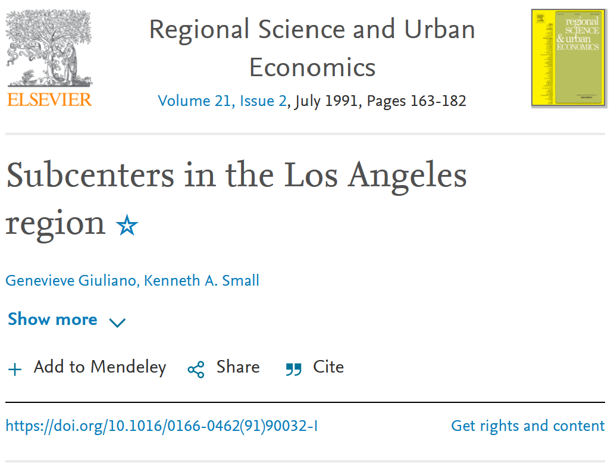
    

    </td>

    <td>
    

    

    </td>

    <td>
    

    

    </td>
</tr>
<tr class='fragment'>
    <td>
    

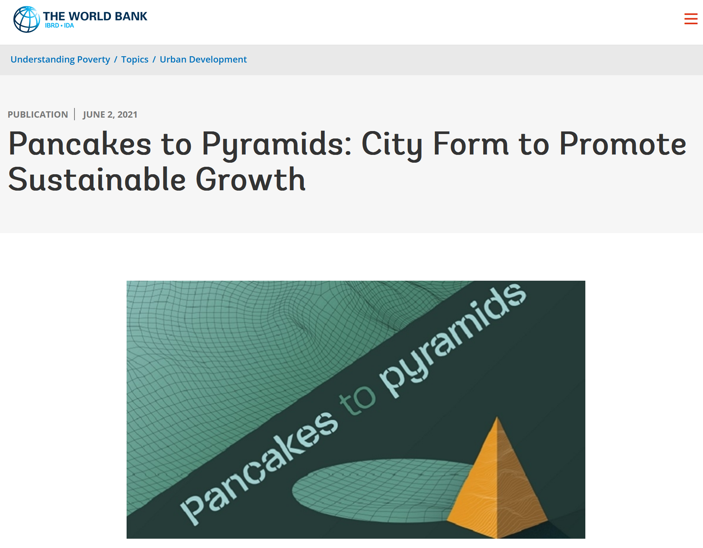
    

    </td>

    <td>
    

    

    </td>

    <td>
    

    

    </td>
</tr>
</table>

## F&F in Regional Science

<table>
    <col width="50%">
    <col width="50%">
    <tr>
        <td>
            

                Critical to understand:
            

        </td>
        <td>
            

                But often:
            

        </td>
    </tr>
    <tr>
<td>

- Agglomeration economies
- Amenities in cities
- Urban/rural
- ...

</td>
<td>

- Coarse
- Aggregate
- Ad-hoc
- ...

</td>
</tr>
</table>

## Detail matters...

<aside class="notes">
233 Vs 2,618 buildings reachable within 15min. walk
</aside>

<table>
<col width="50%">
<col width="50%">
<tr>
    <td>
    

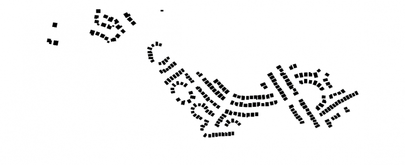
    

    </td>

    <td>
    

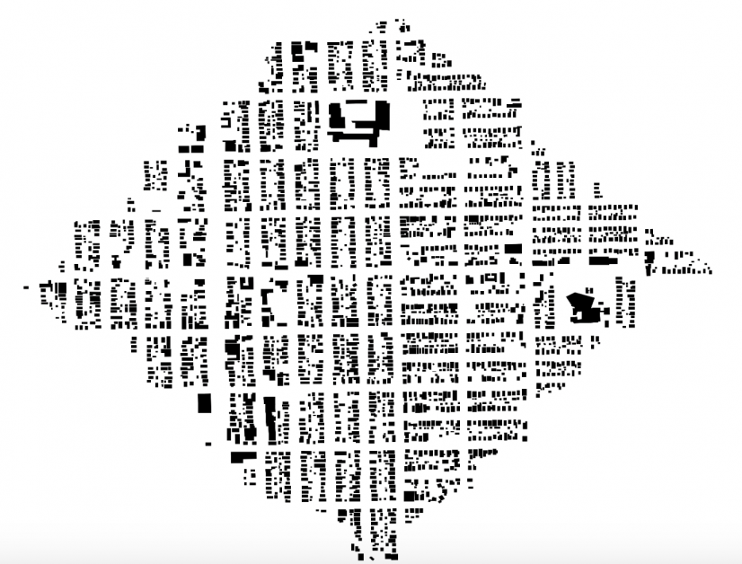
    

    </td>
</tr>
</table>

Source: *Six 15-minute walks capture the diversity, history of Houston neighborhoods* ([Urban Edge](https://kinder.rice.edu/urbanedge/2019/04/08/maps-six-15-minute-walks-capture-diversity-history-houston-neighborhoods))

## 

#
## Urban Grammar

## {data-background-image="../fig/misc/urban_grammar_project.png" data-background-size="contain"}

## {data-transition="none"}

    *Characterisations of space based on form and function designed to understand urban environments*

## {data-transition="none"}

    *Characterisations of space based on form and function designed to understand urban
    environments*

## {data-transition="none"}

    *Characterisations of space based on form and function designed to understand urban
    environments*

## {data-transition="none"}

    *Characterisations of space based on form and function designed to understand urban
        environments*

## British Signatures

## {data-transition="none" data-background-image="../fig/sp_sig/classes.png" data-background-size="contain"}

## {data-transition="none" data-background-image="../fig/empirical/signatures_scottish_belt.png" data-background-size="cover"}
## {data-transition="none" data-background-image="../fig/empirical/signatures_scottish_belt_countryside.png" data-background-size="cover"}
## {data-transition="none" data-background-image="../fig/empirical/signatures_scottish_belt_periphery.png" data-background-size="cover"}
## {data-transition="none" data-background-image="../fig/empirical/signatures_scottish_belt_urban.png" data-background-size="cover"}

##

<table>
<col width="50%">
<col width="50%">
<tr>
    <td>
    

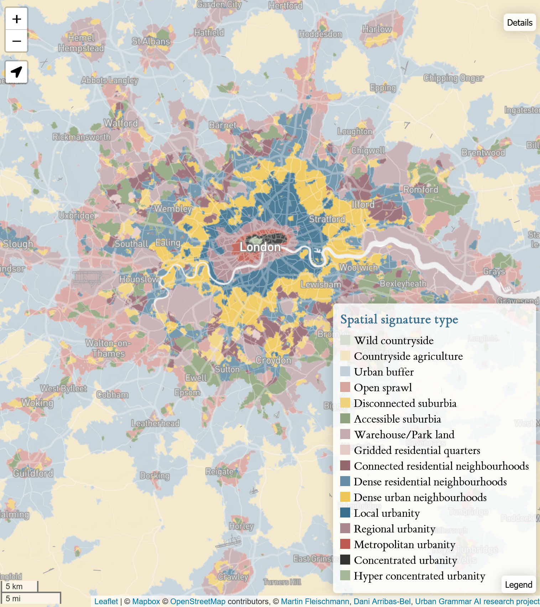
    

    </td>

    <td>
    

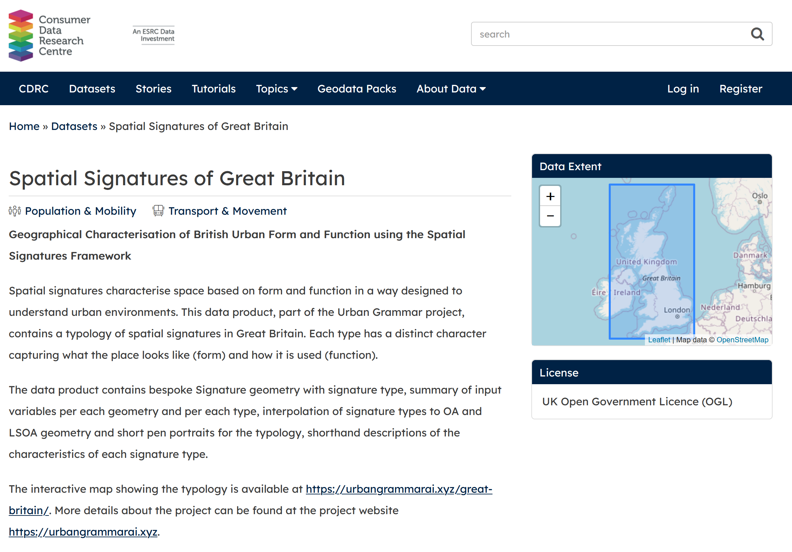
    

    </td>
</tr>
</table>

## Sub-classifications

<table>
<col width="50%">
<col width="50%">
<tr>
    <td>
    

<a href='https://strathprints.strath.ac.uk/80527/1/Fleischmann_Bel_ISUF_2021_Classifying_urban_form_at_national_scale.pdf'>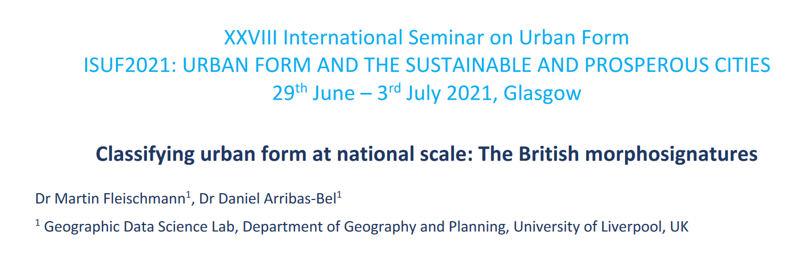</a>
    

    </td>

    <td>
    

<a href='https://doi.org/10.1016/j.dib.2022.108335'>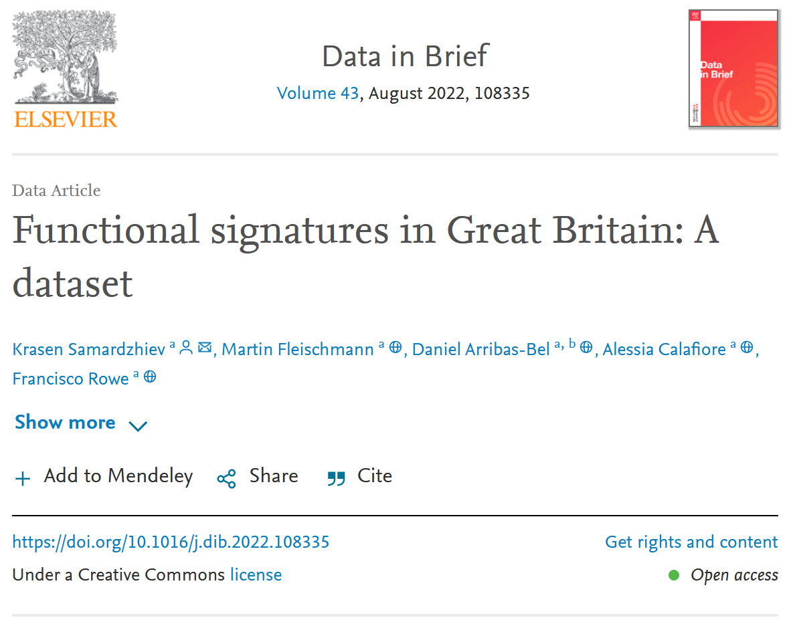</a>
    

    </td>
</tr>
</table>

## Building *Spatial Signatures* {data-transition="none"}

<SMALL>
**[STAGE]**
Delimiters
Enclosure
Anchors
Encl. Tess.
Characters
Clusters
Signatures
</SMALL>

<table>
<col width="33%">
<col width="33%">
<col width="33%">
<tr>
    <td>
    

    Enclosed Tessellation
    

    </td>
    <td>
    

    Embedding *form* & *function*
    

    </td>
    <td>
    

    Spatial Signatures
    

    </td>
</tr>

<tr>
    <td>
    

    

    </td>

    <td>
    

    

    </td>

    <td>
    

    

    </td>
</tr>

<tr>
    <td>
    

    +

    

    </td>

    <td>
    

    

    </td>

    <td>
    

    

    </td>
</tr>

<tr>
    <td>
    

    

    </td>

    <td>
    

    

    </td>

    <td>
    

    

    </td>
</tr>

</table>

## Meaningful spatial units

Enclosed tessellation

<table>
    <col width="25%" height="50%">
    <col width="25%" height="50%">
    <col width="25%" height="50%">
    <col width="25%" height="50%">
    <tr>
        <td>
            

                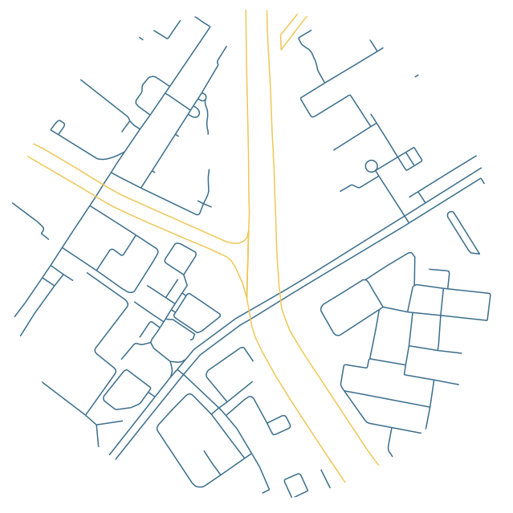
            

        </td>

        <td>
            

                 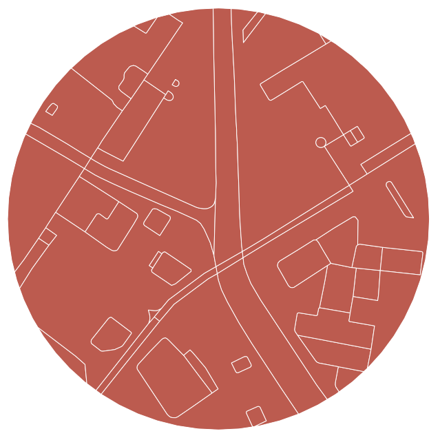
            

        </td>
        <td>
            

                 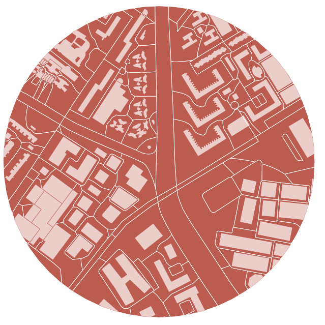
            

        </td>

        <td>
            

                 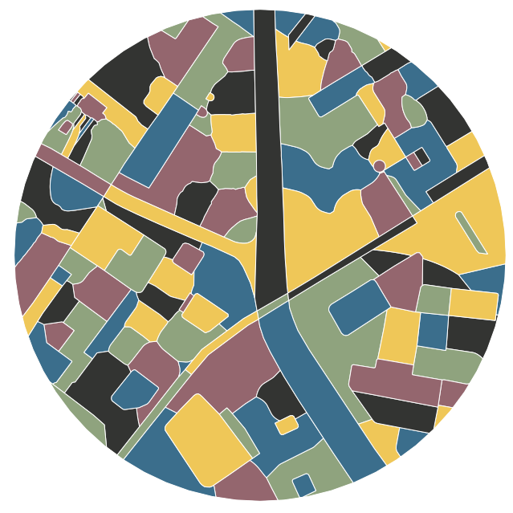
            

        </td>
    </tr>
</table>

## *"Open by default"*

<table>
    <col width="50%">
    <col width="50%">
    <tr>
        <td>
        

        <!--https://www.rawpixel.com/image/573086/antique-cooking-utensils-from-pompeii-->
        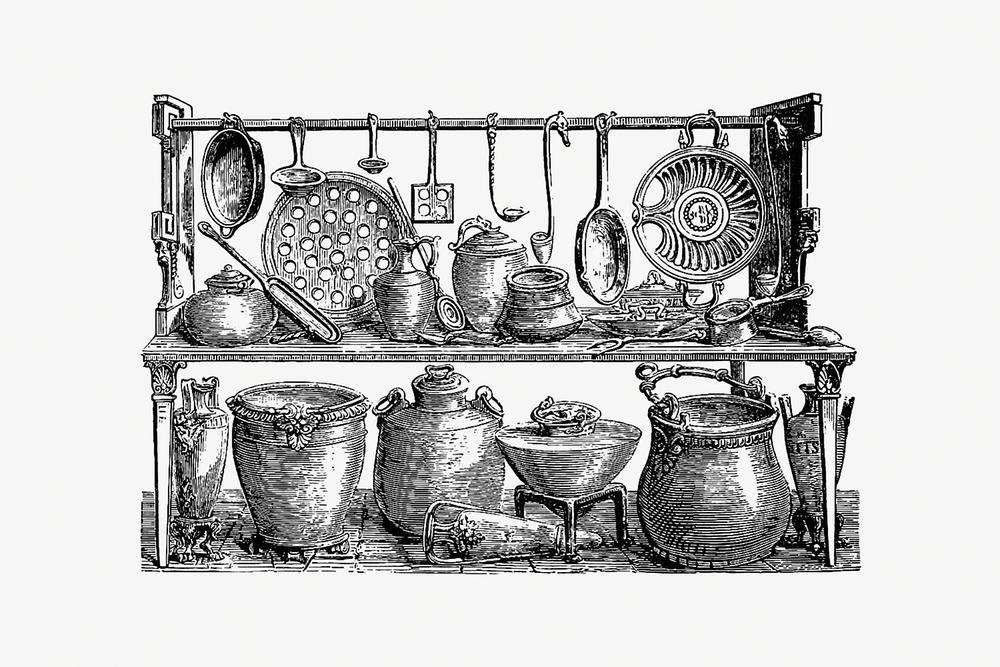
        

        </td>
        <td>
        

        <!--https://freesvg.org/vector-illustration-of-spotty-sausage-->
        
        

        </td>
    </tr>
    <tr>
        <td>
- Data, data, data
- Methods, code
- Infrastructure
        </td>
<td>
- Dissemination
- Open Data Products
- Journaling/reporting
</td>
    </tr>
</table>

    https://urbangrammarai.xyz

## Lessons

## *Encoding*

<table>
    <col width="33%">
    <col width="33%">
    <col width="33%">
    <tr>
<td class='fragment' data-fragment-index="1"'>

Geography

</td>
<td class='fragment' data-fragment-index="2"'>

History

</td>
<td class='fragment' data-fragment-index="3"'>

Technology

</td>
</tr>
<tr>
<td class='fragment fade-in-then-semi-out' data-fragment-index="1"'>
    

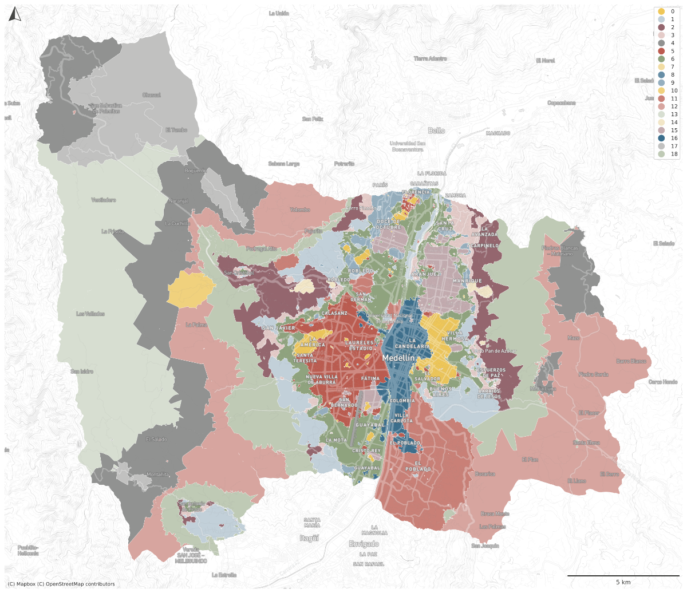
    

</td>
<td class='fragment fade-in-then-semi-out' data-fragment-index="2"'>
    

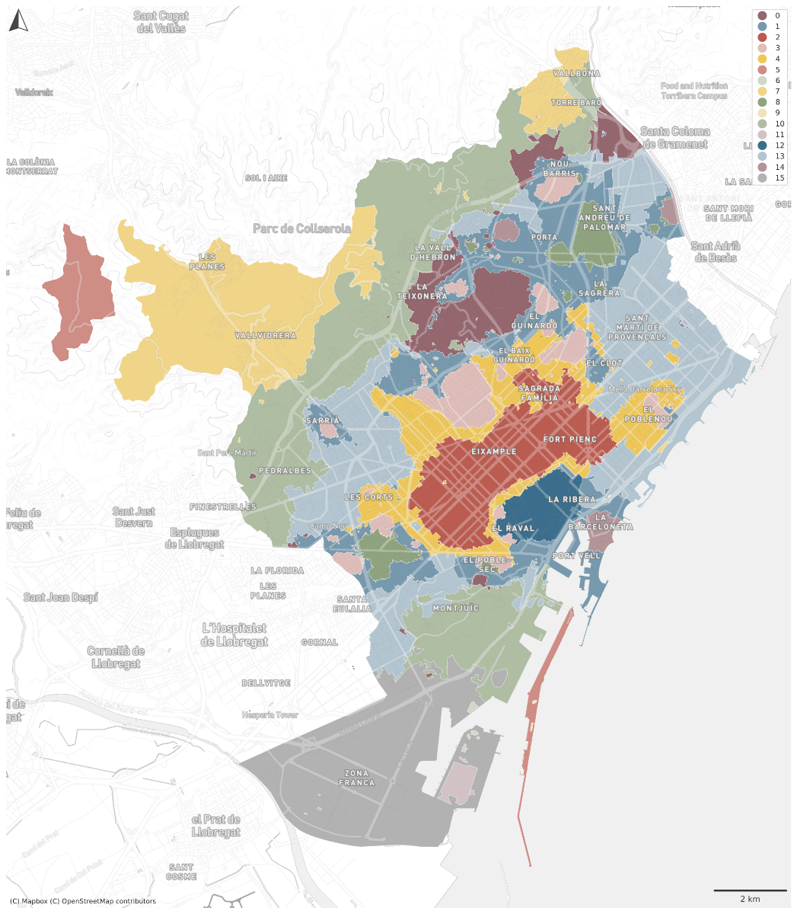
    

</td>
<td class='fragment fade-in-then-semi-out' data-fragment-index="3"'>
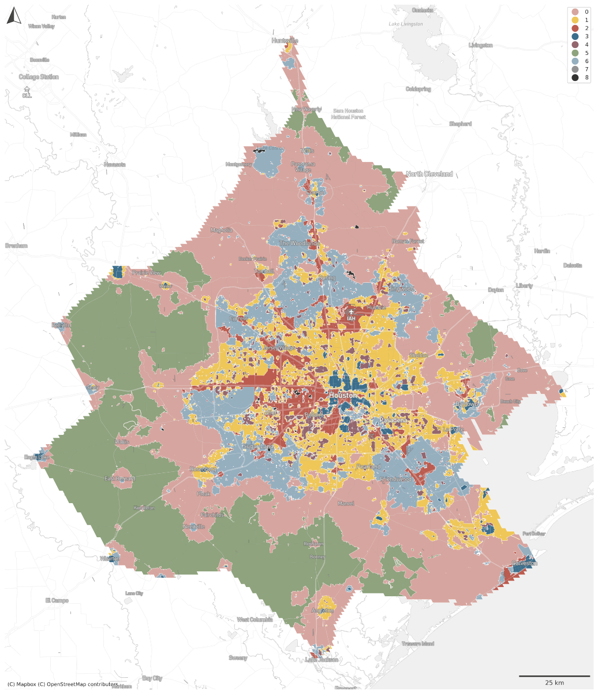
</td>
</tr>
</table>

## Hierarchy

<table>
    <col width="35%">
    <col width="75%">
    <tr>
        <td class='fragment fade-in-then-semi-out'>
            

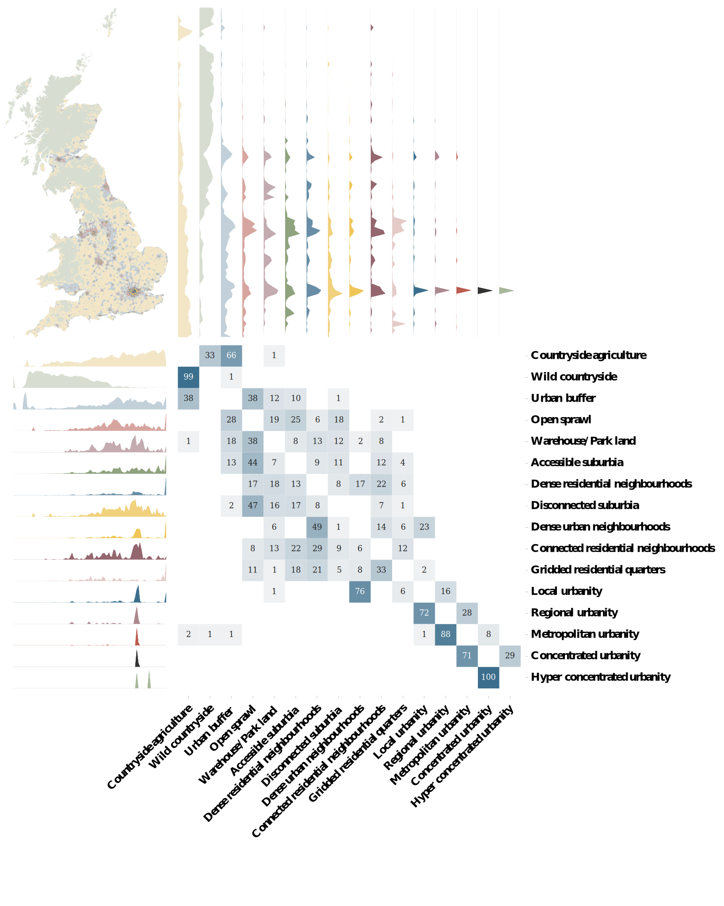
            

        </td>
        <td class='fragment'>
            

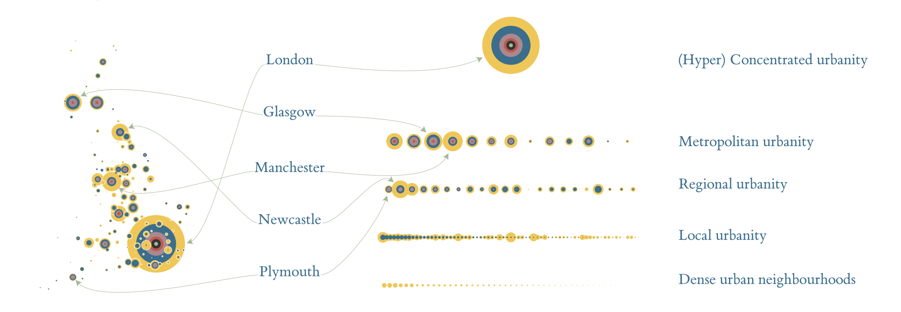
            

        </td>
    </tr>
</table>

## *Framing?*

#
## A peek into the future

##

&#x1F4E1; &#x1F30E; + &#x1F4BB;  + &#x1F916;

##

<table>
<col width="33%" height="50%">
<col width="33%" height="50%">
<col width="33%" height="50%">
<tr>
    <td>
    

    

    </td>

    <td>
    

<a href='https://sentinels.copernicus.eu/web/sentinel/home'>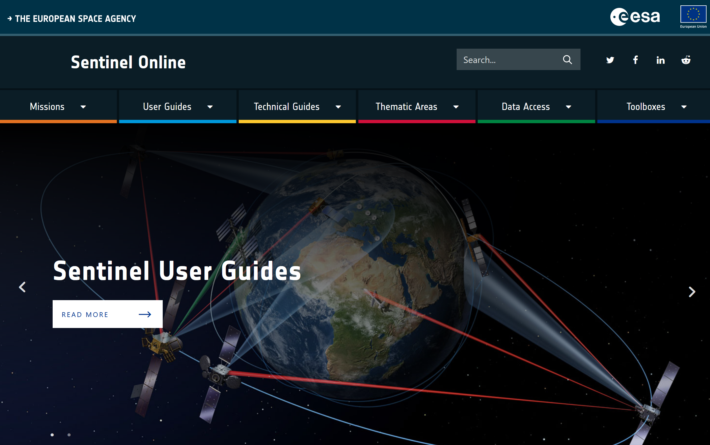</a>
    

    </td>

    <td>
    

    

    </td>
<tr class='fragment'>
    <td>
    

<a href='https://ghsl.jrc.ec.europa.eu/'>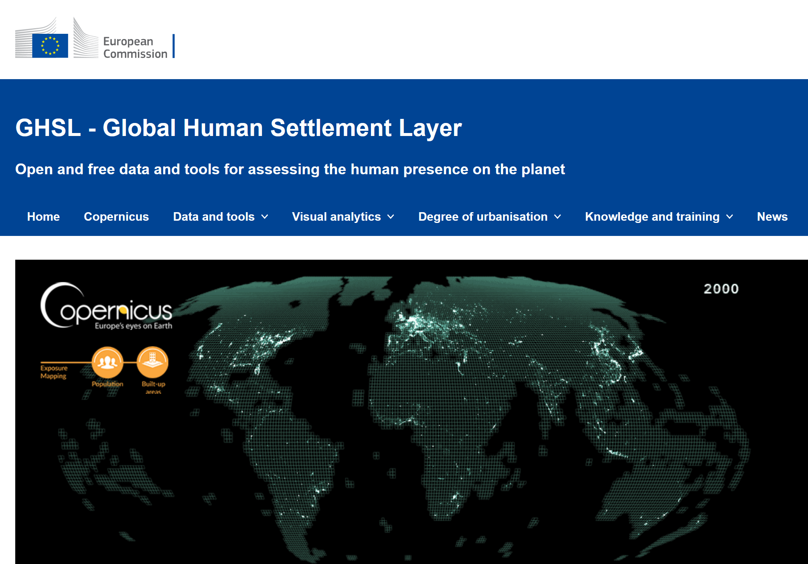</a>
    

    </td>

    <td>
    

    

    </td>

    <td>
    

<a href='https://livingatlas.arcgis.com/landcover/'>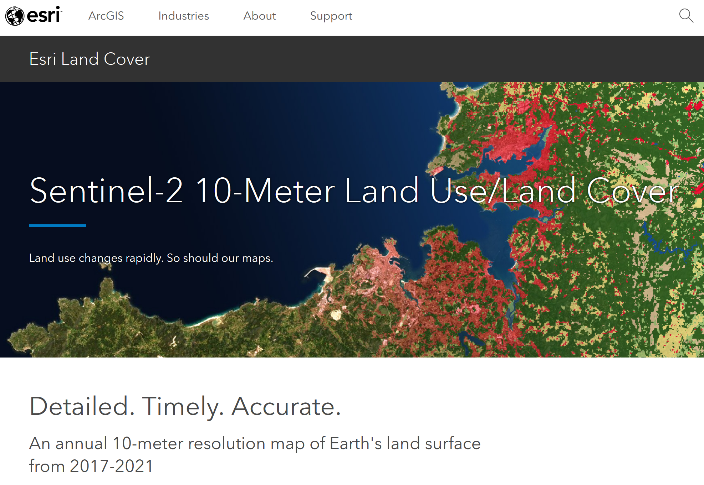</a>
    

    </td>
</tr>
</tr>
</table>

##

*Two examples on Form & Function...*

## {data-background-color="#09101d" data-background-image="../fig/misc/pc_classi_stirling.png" data-background-size="contain"}

<a href='https://studio.unfolded.ai/public/c40f0a5b-a1f8-48af-8b7d-7c258942cf0d'></a>

## {data-transition="none" data-background-image="../fig/misc/nw_signatures.png" data-background-size="contain"}

## {data-transition="none" data-background-image="../fig/misc/nw_sentinel.png" data-background-size="contain"}

Source: <a href='https://s2maps.eu/'>Sentinel-2 cloudless</a>

## {data-transition="none" data-background-image="../fig/gisruk/mor_country.png" data-background-size="contain"}

Wild countryside (320x320m)

## {data-transition="none" data-background-image="../fig/gisruk/mor_urban.png" data-background-size="contain"}

Urbanity (320x320m)

## {data-transition="none" data-background-image="../fig/isuf/mor_all.png" data-background-size="contain"}

Predicted class (320x320m)

## The Future

<ul>
<li class='fragment'> *Are we there yet?* Certainly not</li>
<li class='fragment'> *Can we even get there?* Maybe</li>
<li class='fragment'> *Worth trying?* Absolutely!</li>
</ul>

#
## Wrap up

(Urban) form & function...

- underpin much of Regional Science
- are becoming easier to measure better
- You should use them more in your work!

# Urban Grammar

    <h4>
    *Making it easy for Regional Scientists to consider (urban) form & function*
    </h4>

**SEA Lecture'22**

<table>
    <col width="50%">
    <col width="50%">
    <tr>
        <td>
            

                <a href="https://darribas.org"><b>Dani Arribas-Bel</b></a>
                 `@darribas`
            

        </td>
        <td>
            

                <a href="https://martinfleischmann.net/"><b>Martin Fleischmann</b></a>
                 `@martinfleis`
            

        </td>
    </tr>

</table>

<table>
    <col width="27%">
    <col width="27%">
    <col width="27%">
    <col width="15%">
    <tr>
        <td>
            
        </td>
        <td>
            
        </td>
        <td>
            
        </td>
        <td>
            
        </td>
    </tr>
</table>

