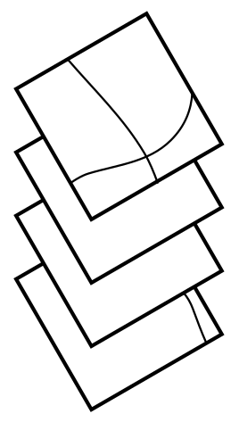

# Urban Grammar

    <h4>
    *Measuring (even) better the Urban-Rural continuum*
    </h4>

**The Future of Cities policy briefs**

<table>
    <col width="50%">
    <col width="50%">
    <tr>
        <td>
            

                <a href="https://darribas.org"><b>Dani Arribas-Bel</b></a>
                 `@darribas`
            

        </td>
        <td>
            

                <a href="https://martinfleischmann.net/"><b>Martin Fleischmann</b></a>
                 `@martinfleis`
            

        </td>
    </tr>

</table>

<table>
    <col width="27%">
    <col width="27%">
    <col width="27%">
    <col width="15%">
    <tr>
        <td>
            
        </td>
        <td>
            
        </td>
        <td>
            
        </td>
        <td>
            
        </td>
    </tr>
</table>

#
## Urban-Rural Continuum

## The importance of getting measurement right

- MAUP
- *Urban* and *rural* are "in the eyes of the beholder"
- More granularity, more (not just better) insight 

## Measuring the Urban-Rural Continuum

#
## {data-background-image="../fig/misc/urban_grammar_project.png" data-background-size="contain"}
## Disclaimer

> The following is not criticism (but endorsement) of the (principle behind the) Degree of Urbanisation (DEGURBA)

## {data-transition="none" data-background-image="../fig/sp_sig/classes.png" data-background-size="contain"}

## {data-transition="none" data-background-image="../fig/empirical/signatures_scottish_belt.png" data-background-size="cover"}
## {data-transition="none" data-background-image="../fig/empirical/signatures_scottish_belt_countryside.png" data-background-size="cover"}
## {data-transition="none" data-background-image="../fig/empirical/signatures_scottish_belt_periphery.png" data-background-size="cover"}
## {data-transition="none" data-background-image="../fig/empirical/signatures_scottish_belt_urban.png" data-background-size="cover"}

#
## Science <del>Fiction</del>

&#x1F4E1; &#x1F30E; + &#x1F4BB;  + &#x1F916;

## {data-transition="none" data-background-image="../fig/misc/nw_signatures.png" data-background-size="contain"}

## {data-transition="none" data-background-image="../fig/misc/nw_sentinel.png" data-background-size="contain"}

Source: <a href='https://s2maps.eu/'>Sentinel-2 cloudless</a>

## {data-transition="none" data-background-image="../fig/gisruk/mor_country.png" data-background-size="contain"}

Wild countryside (320x320m)

## {data-transition="none" data-background-image="../fig/gisruk/mor_urban.png" data-background-size="contain"}

Urbanity (320x320m)

## {data-transition="none" data-background-image="../fig/isuf/mor_all.png" data-background-size="contain"}

Predicted class (320x320m)

##

<table>
<col width="50%">
<col width="50%">
<tr>
    <td>
    

    

    </td>

    <td>
    

    

    </td>
</tr>
</table>

## Building *Spatial Signatures* {data-transition="none"}

<SMALL>
**[STAGE]**
Delimiters
Enclosure
Anchors
Encl. Tess.
Characters
Clusters
Signatures
</SMALL>

<table>
<col width="33%">
<col width="33%">
<col width="33%">
<tr>
    <td>
    

    Enclosed Tessellation
    

    </td>
    <td>
    

    Embedding *form* & *function*
    

    </td>
    <td>
    

    Spatial Signatures
    

    </td>
</tr>

<tr>
    <td>
    

    

    </td>

    <td>
    

    

    </td>

    <td>
    

    

    </td>
</tr>

<tr>
    <td>
    

    +

    

    </td>

    <td>
    

    

    </td>

    <td>
    

    

    </td>
</tr>

<tr>
    <td>
    

    

    </td>

    <td>
    

    

    </td>

    <td>
    

    

    </td>
</tr>

</table>

