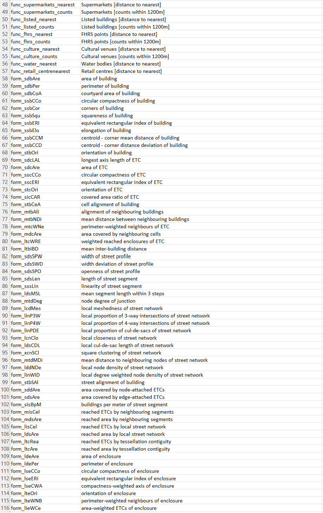
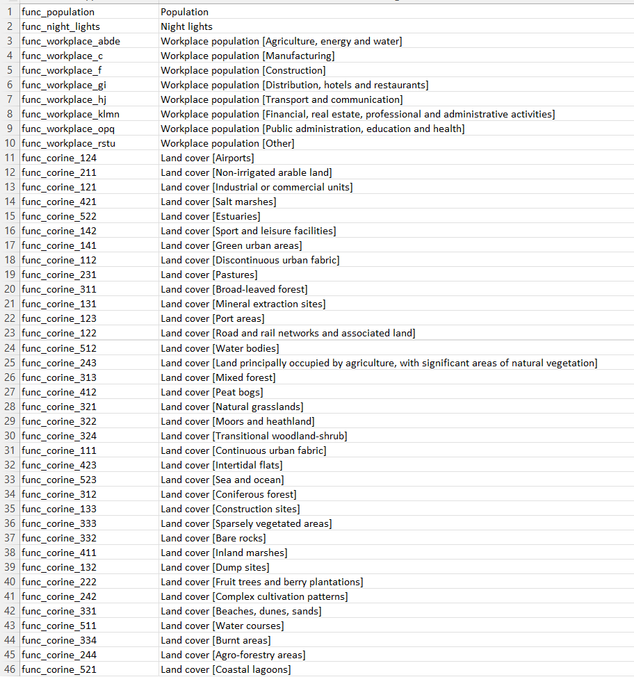
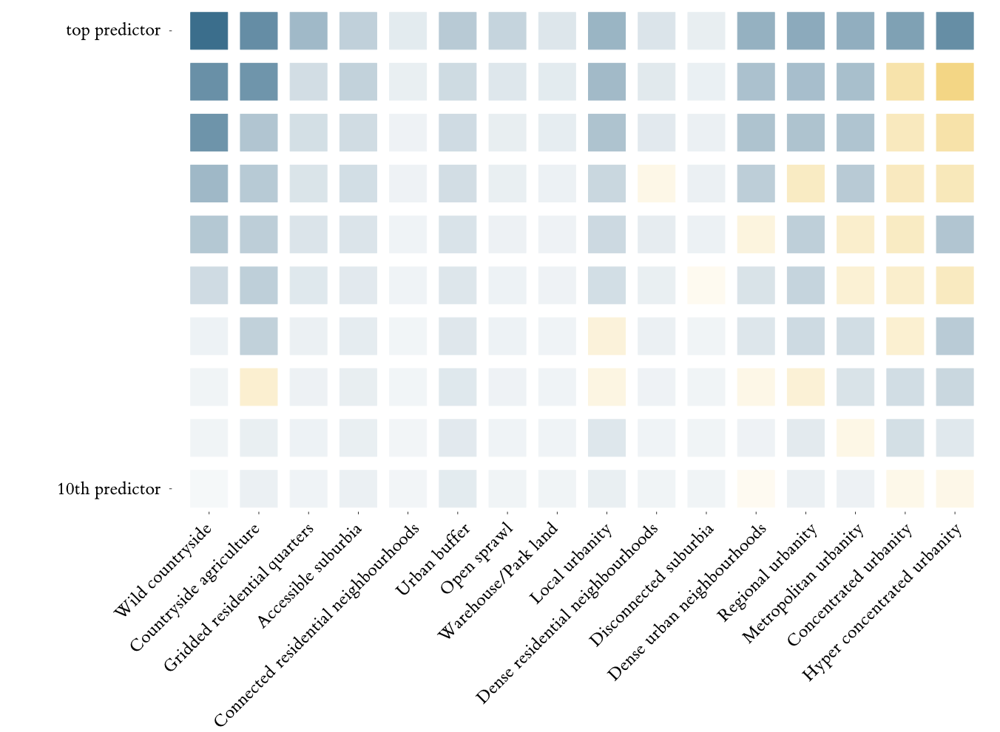

# Urban Grammar

    <h4>
    *Decoding urban form and function in Great Britain*
    </h4>

<SMALL>
**Department of Geography and Environment - LSE**
</SMALL>

<table>
    <col width="50%">
    <col width="50%">
    <tr>
        <td>
            

                <a href="https://darribas.org"><b>Dani Arribas-Bel</b></a>
                 `@darribas`
            

        </td>
        <td>
            

                <a href="https://martinfleischmann.net/"><b>Martin Fleischmann</b></a>
                 `@martinfleis`
            

        </td>
    </tr>

</table>

<table>
    <col width="33%">
    <col width="33%">
    <col width="33%">
    <tr>
        <td>
            
        </td>
        <td>
            
        </td>
        <td>
            
        </td>
    </tr>
</table>

#
##

<!-- Licensed to share -->

## This talk... {data-transition="none"}

... **is *not* about**:

- Exogenous sources of variation
- Local Average Treatment Effects
- Quasi-natural experiments

## This talk... {data-transition="none"}

... **_is_ about**:

- 🏙️ (Urban) form & function
- 📈 Detailed, consistent & scalable (open) data
- Also: 🗺️ maps, 🧱 city structure, 🛰️ satellites...

<aside class="notes">
- "data": i.e., opportunities/inputs for YOU
- Also, hey!, emojis!
</aside>

#
## (Urban)   Form & Function

## F&F: *What*

`Form`

*What does it look like?*

"Physical structure and appearance of cities"

`Function`

*What is it used for?*

"Activities that take place within an environment"

## F&F: *Why*

<table>
    <col width="50%">
    <col width="50%">
    <tr>
        <td>
            

                *Encode* the past
            

        </td>
        <td>
            

                *Frame* the future
            

        </td>
    </tr>
    <tr>
<td>

- Geography
- History
- Technology
- ...

</td>
<td>

- Productivity
- Sustainability
- Quality of Life
- ...

</td>
</tr>
</table>

## F&F: *Why*

<table>
<col width="33%" height="50%">
<col width="33%" height="50%">
<col width="33%" height="50%">
<tr>
    <td>
    

    

    </td>

    <td>
    

    

    </td>

    <td>
    

    

    </td>
</tr>
<tr class='fragment'>
    <td>
    

    

    </td>

    <td>
    

    

    </td>

    <td>
    

    

    </td>
</tr>
</table>

## F&F: *How*

<table>
<col width="33%" height="50%">
<col width="33%" height="50%">
<col width="33%" height="50%">
<tr>
    <td>
    

    
    

    </td>
    <td class='fragment'>
    

    
    

    </td>
    <td>
    

    
    

    </td>
<tr>
    <td>
</table>

<aside class='notes'>
- It's a continuum from traditional (natural) land cover to (social) geodem
- The centre is a sparse area with some urban land use (e.g., Urban Atlas)
- Single-use, not morphology
</aside>

## 

#
## {data-background-image="../fig/misc/urban_grammar_project.png" data-background-size="contain"}

## {data-transition="none"}

    *Characterisations of space based on form and function designed to understand urban environments*

## {data-transition="none"}

    *Characterisations of space based on form and function designed to understand urban
    environments*

## {data-transition="none"}

    *Characterisations of space based on form and function designed to understand urban
    environments*

## {data-transition="none"}

    *Characterisations of space based on form and function designed to understand urban
        environments*

## British Signatures

## {data-transition="none" data-background-image="../fig/sp_sig/classes.png" data-background-size="contain"}

## Building *Spatial Signatures* {data-transition="none"}

<SMALL>
**[STAGE]**
Delimiters
Enclosure
Anchors
Encl. Tess.
Characters
Clusters
Signatures
</SMALL>

<table>
<col width="33%">
<col width="33%">
<col width="33%">
<tr>
    <td>
    

    Enclosed Tessellation
    

    </td>
    <td>
    

    Embedding *form* & *function*
    

    </td>
    <td>
    

    Spatial Signatures
    

    </td>
</tr>

<tr>
    <td class="fragment fade-in-then-semi-out" data-fragment-index="4">
    

    

    </td>

    <td class="fragment fade-in-then-semi-out" data-fragment-index="5">
    

    

    </td>

    <td class="fragment fade-in-then-semi-out" data-fragment-index="7">
    

    

    </td>
</tr>

<tr>
    <td class="fragment fade-in-then-semi-out" data-fragment-index="2">
    

    +

    

    </td>

    <td>
    

    

    </td>

    <td class="fragment fade-in-then-semi-out" data-fragment-index="6">
    

    

    </td>
</tr>

<tr>
    <td class="fragment fade-in-then-semi-out" data-fragment-index="1">
    

    

    </td>

    <td>
    

    

    </td>

    <td>
    

    

    </td>
</tr>

</table>

## Building *Spatial Signatures* {data-transition="none"}

<SMALL>
**[STAGE]**
Delimiters
Enclosure
Anchors
Encl. Tess.
Characters
Clusters
Signatures
</SMALL>

<table>
<col width="33%">
<col width="33%">
<col width="33%">
<tr>
    <td>
    

    Enclosed Tessellation
    

    </td>
    <td>
    

    Embedding *form* & *function*
    

    </td>
    <td>
    

    Spatial Signatures
    

    </td>
</tr>

<tr>
    <td>
    

    

    </td>

    <td>
    

    

    </td>

    <td>
    

    

    </td>
</tr>

<tr>
    <td>
    

    +

    

    </td>

    <td>
    

    

    </td>

    <td>
    

    

    </td>
</tr>

<tr>
    <td>
    

    

    </td>

    <td>
    

    

    </td>

    <td>
    

    

    </td>
</tr>

</table>

## F&F Characters

<table>
<col width="30%">
<col width="30%">
<col width="20%">
<tr>
    <td>
    

    Form
    

    </td>
    <td>
    

    Function
    

    </td>
    <td>
    

    

    </td>
</tr>
</table>

## Context

##

<table>
<col width="50%">
<col width="50%">
<tr>
    <td>
    

    

    </td>

    <td>
    

    

    </td>
</tr>
</table>

#
## A panoramic of the British (urban) landscape

##

<table>
<col width="60%">
<col width="40%">
<tr>
    <td  style="vertical-align:middle;box-shadow:none">
<u>BRITISH SIGNATURES</u>

**Countryside** (3)
 

**Periphery** (4)
 

**Urban** (9)

 

<!-- <small><a href="http://urbangrammarai.xyz/great-britain/">`urbangrammarai.xyz/great-britain/`</a></small> -->

<small>
    urbangrammarai.xyz/great-britain/
</small>

</td>
<td style="vertical-align:middle;box-shadow:none">

    </td>
</tr>
</table>

## Coverage

## 94% (50%) {data-transition="none" data-background-image="../fig/empirical/cov_countryside.png" data-background-size="contain"}
## 5% (40%) {data-transition="none" data-background-image="../fig/empirical/cov_periphery.png" data-background-size="contain"}
## 1% (10%) {data-transition="none" data-background-image="../fig/empirical/cov_centres.png" data-background-size="contain"}

## Signature Hierarchy
## {data-transition="none" data-background-image="../fig/empirical/geog_distribution_co_occurence.png" data-background-size="contain"}

## Urban Hierarchy
##

<table>
<col width="45%">
<col width="45%">
<col width="10%">
<tr>
    <td>
    

    

    </td>
    <td class='fragment' data-fragment-index="1">
    

    

    </td>
    <td class='fragment' data-fragment-index="1">
*Signature* Dish
    </td>
</tr>
</table>

## {data-transition="none" data-background-image="../fig/empirical/hierarchy.png" data-background-size="contain"}

## {data-transition="none" data-background-image="../fig/empirical/hierarchy_fua.png" data-background-size="contain"}
Signature importance in each OECD's Functional Urban Areas

<aside class='notes'>
This shows, of the total in each FUA, the proportion a signature is taking

We prefer this because it is not (as) tied to city size. One could think of a
very urban small town with a very urban top class of small size but that takes
up most of the town. And we'd want to place that high up in the hierarchy.
</aside>

#
## A peak into the future

&#x1F4E1; &#x1F30E; + &#x1F4BB;  + &#x1F916;

## &#x1F4E1; &#x1F30E;

<table>
<col width="33%" height="50%">
<col width="33%" height="50%">
<col width="33%" height="50%">
<tr>
    <td>
    

    

    </td>

    <td>
    

    

    </td>

    <td>
    

    

    </td>
<tr class='fragment'>
    <td>
    

    

    </td>

    <td>
    

    

    </td>

    <td>
    

    

    </td>
</tr>
</tr>
</table>

## {data-transition="none" data-background-image="../fig/misc/nw_signatures.png" data-background-size="contain"}

## {data-transition="none" data-background-image="../fig/misc/nw_sentinel.png" data-background-size="contain"}

Source: <a href='https://s2maps.eu/'>Sentinel-2 cloudless</a>

## {data-transition="none" data-background-image="../fig/gisruk/mor_country.png" data-background-size="contain"}

Wild countryside (320x320m)

## {data-transition="none" data-background-image="../fig/gisruk/mor_urban.png" data-background-size="contain"}

Urbanity (320x320m)

## {data-transition="none" data-background-image="../fig/isuf/mor_all.png" data-background-size="contain"}

Predicted class (320x320m)

## {data-background-image="https://media0.giphy.com/media/3o72FkiKGMGauydfyg/giphy.gif?cid=ecf05e47o2znkhbe85zulwtbkhmk9a6n3t0izn5qll5lcmmc&ep=v1_gifs_search&rid=giphy.gif&ct=g" data-background-size="contain" data-background-color='black'}

#
## Wrap up

- Urban F&F is important, interesting and relevant
- We should (and can!) measure it in *detailed*, *consistent* and *scalable*
  ways
- Once available (*now!*), we can build much on top (e.g., hierarchies)

# Urban Grammar

    <h4>
    *Decoding urban form and function in Great Britain*
    </h4>

<SMALL>
**Department of Geography and Environment - LSE**
</SMALL>

<table>
    <col width="50%">
    <col width="50%">
    <tr>
        <td>
            

                <a href="https://darribas.org"><b>Dani Arribas-Bel</b></a>
                 `@darribas`
            

        </td>
        <td>
            

                <a href="https://martinfleischmann.net/"><b>Martin Fleischmann</b></a>
                 `@martinfleis`
            

        </td>
    </tr>

</table>

<table>
    <col width="33%">
    <col width="33%">
    <col width="33%">
    <tr>
        <td>
            
        </td>
        <td>
            
        </td>
        <td>
            
        </td>
    </tr>
</table>

#
## Appendix

## Meaningful spatial units

Enclosed tessellation

<table>
    <col width="25%" height="50%">
    <col width="25%" height="50%">
    <col width="25%" height="50%">
    <col width="25%" height="50%">
    <tr>
        <td>
            

                
            

        </td>

        <td>
            

                 
            

        </td>
        <td>
            

                 
            

        </td>

        <td>
            

                 
            

        </td>
    </tr>
</table>

## {data-transition="none" data-background-image="../fig/empirical/signatures_scottish_belt.png" data-background-size="cover"}
## {data-transition="none" data-background-image="../fig/empirical/signatures_scottish_belt_countryside.png" data-background-size="cover"}
## {data-transition="none" data-background-image="../fig/empirical/signatures_scottish_belt_periphery.png" data-background-size="cover"}
## {data-transition="none" data-background-image="../fig/empirical/signatures_scottish_belt_urban.png" data-background-size="cover"}

## Sub-classifications

<table>
<col width="50%">
<col width="50%">
<tr>
    <td>
    

    

    </td>

    <td>
    

    

    </td>
</tr>
</table>

## Signature drivers

## {data-transition="none" data-background-image="../fig/empirical/hierarchy_ttwa.png" data-background-size="contain"}
Signature proportion within ONS Travel to Work Areas
