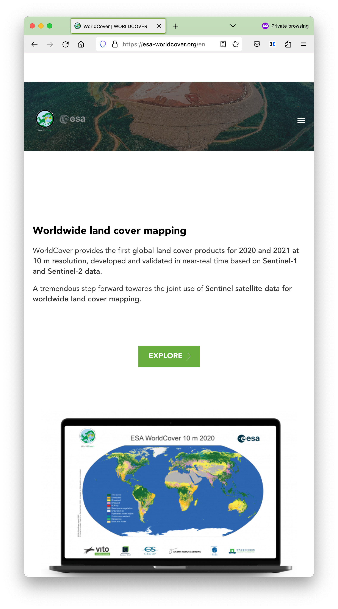
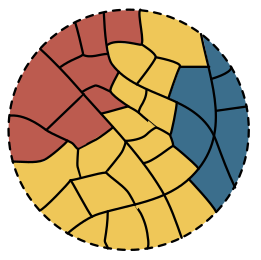

# Urban Grammar

    <h4>
    *Decoding urban form and function in Great Britain*
    </h4>

<SMALL>
**Department of Geography and Environment - LSE**
</SMALL>

<table>
    <col width="50%">
    <col width="50%">
    <tr>
        <td>
            

                <a href="https://darribas.org"><b>Dani Arribas-Bel</b></a>
                 `@darribas`
            

        </td>
        <td>
            

                <a href="https://martinfleischmann.net/"><b>Martin Fleischmann</b></a>
                 `@martinfleis`
            

        </td>
    </tr>

</table>

<table>
    <col width="33%">
    <col width="33%">
    <col width="33%">
    <tr>
        <td>
            
        </td>
        <td>
            
        </td>
        <td>
            
        </td>
    </tr>
</table>

#
##

<!-- Licensed to share -->

## This talk... {data-transition="none"}

... **is *not* about**:

- Exogenous sources of variation
- Local Average Treatment Effects
- Quasi-natural experiments

## This talk... {data-transition="none"}

... **_is_ about**:

- 🏙️ (Urban) form & function
- 📈 Detailed, consistent & scalable (open) data
- Also: 🗺️ maps, 🧱 city structure, 🛰️ satellites...

<aside class="notes">
- "data": i.e., opportunities/inputs for YOU
- Also, hey!, emojis!
</aside>

#
## (Urban)   Form & Function

## F&F: *What*

`Form`

*What does it look like?*

"Physical structure and appearance of cities"

`Function`

*What is it used for?*

"Activities that take place within an environment"

## F&F: *Why*

<table>
    <col width="50%">
    <col width="50%">
    <tr>
        <td>
            

                *Encodes* the past
            

        </td>
        <td>
            

                *Frames* the future
            

        </td>
    </tr>
    <tr>
<td>

- Geography
- History
- Technology
- ...

</td>
<td>

- Productivity
- Sustainability
- Quality of Life
- ...

</td>
</tr>
</table>

## F&F: *Why*

<table>
<col width="33%" height="50%">
<col width="33%" height="50%">
<col width="33%" height="50%">
<tr>
    <td>
    

    

    </td>

    <td>
    

    

    </td>

    <td>
    

    

    </td>
</tr>
<tr class='fragment'>
    <td>
    

    

    </td>

    <td>
    

    

    </td>

    <td>
    

    

    </td>
</tr>
</table>

## F&F: *How*

<table>
<col width="33%" height="50%">
<col width="33%" height="50%">
<col width="33%" height="50%">
<tr>
    <td>
    

    
    

    </td>
    <td>
    

    
    

    </td>
    <td>
    

    
    

    </td>
<tr>
    <td>
</table>

<aside class='notes'>
- It's a continuum from traditional (natural) land cover to (social) geodem
- The centre is a sparse area with some urban land use (e.g., Urban Atlas)
- Single-use, not morphology
</aside>

## 

#
## {data-background-image="../fig/misc/urban_grammar_project.png" data-background-size="contain"}

## {data-transition="none"}

    *Characterisations of space based on form and function designed to understand urban environments*

## {data-transition="none"}

    *Characterisations of space based on form and function designed to understand urban
    environments*

## {data-transition="none"}

    *Characterisations of space based on form and function designed to understand urban
    environments*

## {data-transition="none"}

    *Characterisations of space based on form and function designed to understand urban
        environments*

## British Signatures

## {data-transition="none" data-background-image="../fig/sp_sig/classes.png" data-background-size="contain"}

## {data-transition="none" data-background-image="../fig/empirical/signatures_scottish_belt.png" data-background-size="cover"}
## {data-transition="none" data-background-image="../fig/empirical/signatures_scottish_belt_countryside.png" data-background-size="cover"}
## {data-transition="none" data-background-image="../fig/empirical/signatures_scottish_belt_periphery.png" data-background-size="cover"}
## {data-transition="none" data-background-image="../fig/empirical/signatures_scottish_belt_urban.png" data-background-size="cover"}

##

<table>
<col width="50%">
<col width="50%">
<tr>
    <td>
    

    

    </td>

    <td>
    

    

    </td>
</tr>
</table>

## Building *Spatial Signatures* {data-transition="none"}

<SMALL>
**[STAGE]**
Delimiters
Enclosure
Anchors
Encl. Tess.
Characters
Clusters
Signatures
</SMALL>

<table>
<col width="33%">
<col width="33%">
<col width="33%">
<tr>
    <td>
    

    Enclosed Tessellation
    

    </td>
    <td>
    

    Embedding *form* & *function*
    

    </td>
    <td>
    

    Spatial Signatures
    

    </td>
</tr>

<tr>
    <td>
    

    

    </td>

    <td>
    

    

    </td>

    <td>
    

    

    </td>
</tr>

<tr>
    <td>
    

    +

    

    </td>

    <td>
    

    

    </td>

    <td>
    

    

    </td>
</tr>

<tr>
    <td>
    

    

    </td>

    <td>
    

    

    </td>

    <td>
    

    

    </td>
</tr>

</table>

#
##

&#x1F4E1; &#x1F30E; + &#x1F4BB;  + &#x1F916;

## {data-transition="none" data-background-image="../fig/misc/nw_signatures.png" data-background-size="contain"}

## {data-transition="none" data-background-image="../fig/misc/nw_sentinel.png" data-background-size="contain"}

Source: <a href='https://s2maps.eu/'>Sentinel-2 cloudless</a>

## {data-transition="none" data-background-image="../fig/gisruk/mor_country.png" data-background-size="contain"}

Wild countryside (320x320m)

## {data-transition="none" data-background-image="../fig/gisruk/mor_urban.png" data-background-size="contain"}

Urbanity (320x320m)

## {data-transition="none" data-background-image="../fig/isuf/mor_all.png" data-background-size="contain"}

Predicted class (320x320m)

##

&#x1F4E1; &#x1F30E; + &#x1F4BB;  + &#x1F916;

***Why***

- Learn about Spatial Signatures (scale, context)
- Explore the role of space in NNs
- Work towards more frequent Spatial Signatures

#
## Experiment's dimensions

## Chip size
<table>
    <col width="25%">
    <col width="25%">
    <col width="25%">
    <col width="25%">
    <tr>
        <td>
        

        
         
        <SMALL>[74%]</SMALL>
        

        </td>
        <td>
        

        
         
        <SMALL>[57%]</SMALL>
        

        </td>
        <td>
        

        
         
        <SMALL>[35%]</SMALL>
        

        </td>
        <td>
        

        
         
        <SMALL>[13%]</SMALL>
        

        </td>
    </tr>
</table>

## (Spatial) data augmentation

## Model architecture

<table>
<col width="30%">
<col width="70%">
<tr>
<td>
`EfficientNetB4`

- Image Classification
- Multi-Output Regression
</td>
<td class='fragment'>

</td>
</tr>
</table>

## Evaluation

<table>
    <col width="35%">
    <col width="65%">
    <tr>
        <td>
`Metrics`

- Standard   [$\kappa$, accuracy, F1]()
- Spatial   [Joint Counts]()
        </td>
<td class='fragment'>
`Summarisation`
 

 

        </td>
    </tr>
</table>

#
## Results

## {data-transition="none" data-background-image="../fig/ai/results_table_1.png" data-background-size="contain"}
## {data-transition="none" data-background-image="../fig/ai/results_table_2.png" data-background-size="contain"}
## {data-transition="none" data-background-image="../fig/ai/results_table_3.png" data-background-size="contain"}

## Summarisation summary

- Extra ML pays off
- M.O.R. worse in general, better _within_ class
- Spatial context *always* improves performance
- Scale: larger is better, except for spatial patterning
- Spatial sliding rarely (within-class)

#
## Wrap up
## Wrap up

<small>[[Source]](https://images.gr-assets.com/hostedimages/1509307588ra/24308520.gif)</small>

## Wrap up

- We *need* to measure cities more, more frequently
- We *can* thanks to the &#x1F4E1; &#x1F30E; + &#x1F4BB;  + &#x1F916; combo
- *How* is still W.I.P., but with a stress on the **P**

# Urban Grammar

    <h4>
    *Decoding urban form and function in Great Britain*
    </h4>

<SMALL>
**Department of Geography and Environment - LSE**
</SMALL>

<table>
    <col width="50%">
    <col width="50%">
    <tr>
        <td>
            

                <a href="https://darribas.org"><b>Dani Arribas-Bel</b></a>
                 `@darribas`
            

        </td>
        <td>
            

                <a href="https://martinfleischmann.net/"><b>Martin Fleischmann</b></a>
                 `@martinfleis`
            

        </td>
    </tr>

</table>

<table>
    <col width="33%">
    <col width="33%">
    <col width="33%">
    <tr>
        <td>
            
        </td>
        <td>
            
        </td>
        <td>
            
        </td>
    </tr>
</table>

#
## Appendix

## Meaningful spatial units

Enclosed tessellation

<table>
    <col width="25%" height="50%">
    <col width="25%" height="50%">
    <col width="25%" height="50%">
    <col width="25%" height="50%">
    <tr>
        <td>
            

                
            

        </td>

        <td>
            

                 
            

        </td>
        <td>
            

                 
            

        </td>

        <td>
            

                 
            

        </td>
    </tr>
</table>

## Hierarchy

<table>
    <col width="35%">
    <col width="75%">
    <tr>
        <td class='fragment fade-in-then-semi-out'>
            

            

        </td>
        <td class='fragment'>
            

            

        </td>
    </tr>
</table>

## Sub-classifications

<table>
<col width="50%">
<col width="50%">
<tr>
    <td>
    

    

    </td>

    <td>
    

    

    </td>
</tr>
</table>

<!-- ############################################################################### -->

## Why satellite data?

<table>
<col width="33%" height="50%">
<col width="33%" height="50%">
<col width="33%" height="50%">
<tr>
    <td>
    

    

    </td>

    <td>
    

    

    </td>

    <td>
    

    

    </td>
<tr class='fragment'>
    <td>
    

    

    </td>

    <td>
    

    

    </td>

    <td>
    

    

    </td>
</tr>
</tr>
</table>

